# Android Activity生命周期&启动模式详解


## 从四个视角理解Android Activity启动模式

- 从Android软件体系架构的角度来看
- 从Android系统Task来看
- 从Activity生命周期来看
- 从Activity启动方式来看

## Task

- Task是属于Android系统的任务栈,一个Task中可以包含有多个application的Activity
- Activity代码属于Application，但是Task属于Android操作系统

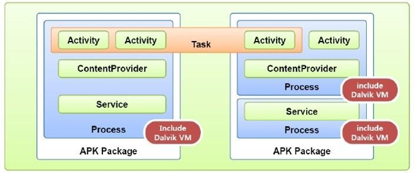

- Android中如何查看Task

1.可以在Android studio 中的terminal中输入命令

```
 adb shell dumpsys activity activitys

```


2.通过手机navigation方式查看

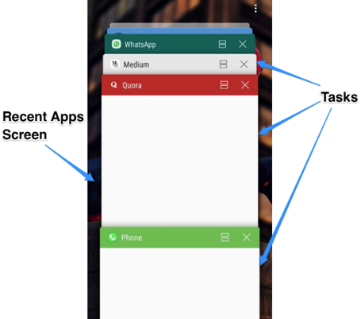

## Task启动方式

- 恢复模式

此种方式属于Activity生命周期由不可见到获得焦点的范畴

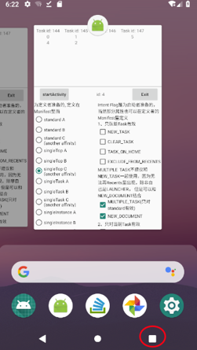


- 新建模式

此种方式如下:

1.通过通知栏打开


2.通过其他第三方App唤醒


<!--more-->


这种启动方式都是由 startActivity()新建的

```java
Intent intent = new Intent(this, DisplayMessageActivity.class);     
EditText editText = (EditText) findViewById(R.id.editText);
String message = editText.getText().toString();
intent.putExtra(EXTRA_MESSAGE, message);
intent.addFlags(Intent.FLAG_ACTIVITY_CLEAR_TASK);
startActivity(intent);

```


- luncher启动模式

luncher启动方式分为两种情况

1.Task不存在

2.Task已经存在


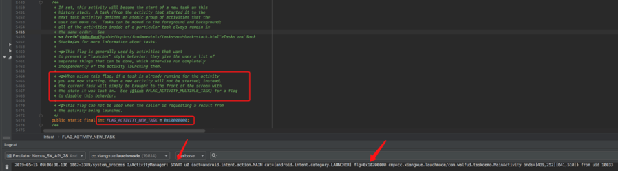


## Activity生命周期

- activity生命周期

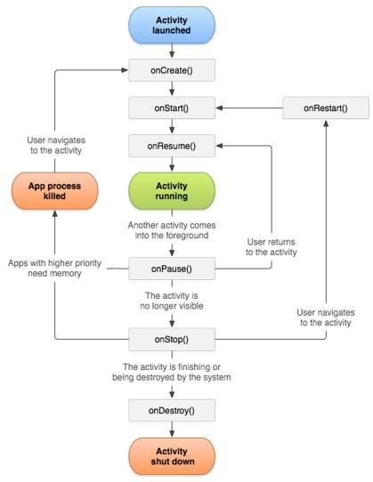

- 对于activity生命周期中各个方法,需要记住他们是成对出现的

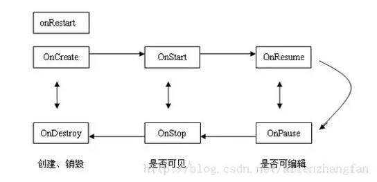

- activity相邻状态之间的区别(面试重点)

在讲解相邻状态之间区别之前,首先我们需要知道当两个activity交互时的生命周期,如图所示:

1.从启动ActivityA 进入到ActivityB的生命周期走向

2.从ActivityB 返回到ActivityA时的生命周期走向

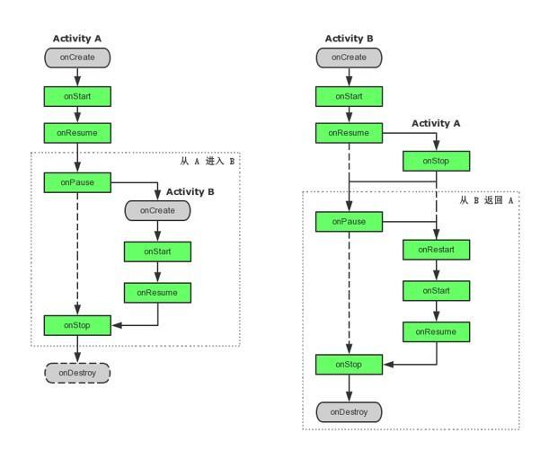

从上图我们可以看到,当ActivityA启动ActivityB时,执行到onPause()时,并没有立即执行onStop();

而是先执行ActivityB 的相应方法,知道ActivityB 的onResume()执行完毕,也就是ActivityB启动成功后,才调用自身的onStop();反之亦是如此

> 这里有一个小技巧
>
> 我们日常开发中,启动App时都会先加载一个splash页面,而关于这个splash页面何时关闭呢?
>
> 2s? 3s? 肯是我们的MainActivity加载完成后再关闭,所以时间是不确定的
>
> 那看了上面的生命周期介绍,我就知道了,放在splashActivity的onStop()方法中执行finish()就ok了

下面我们详细介绍activity生命周期中各个相邻状态之间的区别吧,敲黑板了!!!

1.onCreate和onStart之间有什么区别？

（1）可见与不可见的区别。前者不可见，后者可见。
 （2）执行次数的区别。onCreate方法只在Activity创建时执行一次，而onStart方法在Activity的切换以及按Home键返回桌面再切回应用的过程中被多次调用。因此Bundle数据的恢复在onStart中进行比onCreate中执行更合适。
 （3）onCreate能做的事onStart其实都能做，但是onstart能做的事onCreate却未必适合做。如前文所说的，setContentView和资源初始化在两者都能做，然而想动画的初始化在onStart中做比较好。

2.onStart方法和onResume方法有什么区别？

（1）是否在前台。onStart方法中Activity可见但不在前台，不可交互，而在onResume中在前台。
 （2）职责不同，onStart方法中主要还是进行初始化工作，而onResume方法，根据官方的建议，可以做开启动画和独占设备的操作。

这里解释下,这里所谓的前台并不是我们日常所说的前台任务的那个前台,这里的前台指的是能否与用户产生交互

3.onPause方法和onStop方法有什么区别？

（1）是否可见。onPause时Activity可见，onStop时Activity不可见，但Activity对象还在内存中。
 （2）在系统内存不足的时候可能不会执行onStop方法，因此程序状态的保存、独占设备和动画的关闭、以及一些数据的保存最好在onPause中进行，但要注意不能太耗时。

4.onStop方法和onDestroy方法有什么区别？

onStop阶段Activity还没有被销毁，对象还在内存中，此时可以通过切换Activity再次回到该Activity，而onDestroy阶段Acivity被销毁


- onNewIntent的生命周期

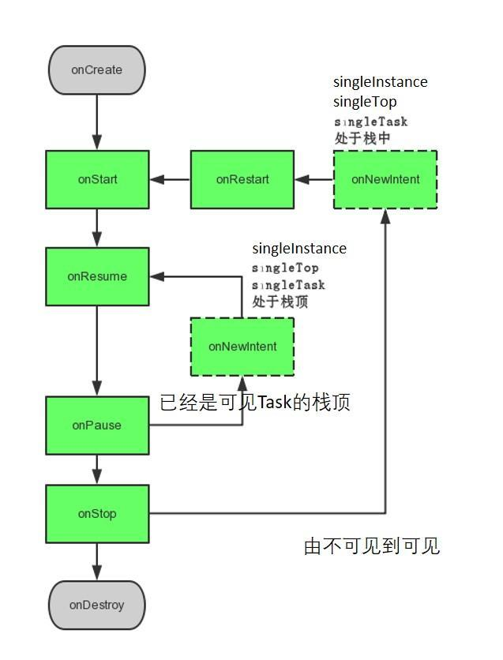


1、只对singleTop，singleTask，singleInstance有效，因为standard每次都是新建，所以不存在onNewIntent；

2、只对startActivity有效，对于从Navigation切换回来的恢复无效；


## Activity的四种启动模式

介绍如图:

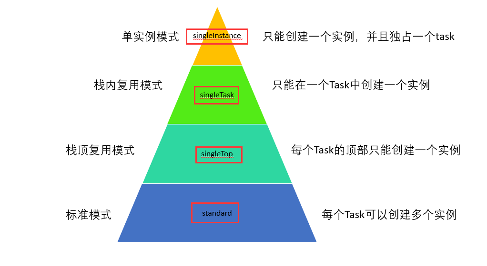


- standard 模式

1.standard 默认模式

系统在启动Activity的任务中创建Activity的新实例并向其传送Intent。Activity可以多次实例化，不管这个实例是否已经存在，而每个实例均可属于不同的任务，并且一个任务可以拥有多个实例。这种模式的Activity被创建时它的onCreate、onStart 都会被调用。这是一种典型的多实例实现，一个任务栈中可以有多个实例，每个实例也可以属于不同的任务栈在这种模式下，谁启动了这个Activity，那么这个Activity就运行在启动它的那个Activity所在的栈中

以下三种情况:

a、当从非Activity的context启动activity时，需要带new_task的flag；

b、当启动一个带有affinity的activity，如果这个activity已经有实例存在该task，则不会重新创建；

c、如果从应用内启动的standard activity的Affinity就是App默认的Affinity，则会每次新建一个实例；

> 小提示:affinity是指Task的标识,而我们一般不指定的话默认就是App的包名,而一旦指定一个affinity,
>
> 那么启动的activity将会在另一个Task中执行,在后台任务切换栏里,你就可以看到两个任务窗口


- singleTop 模式

一个singleTop Activity 的实例可以无限多，唯一的区别是如果在栈顶已经有一个相同类型的Activity实例，Intent不会再创建一个Activity，而是通过onNewIntent()被发送到现有的Activity。

分析图如下:

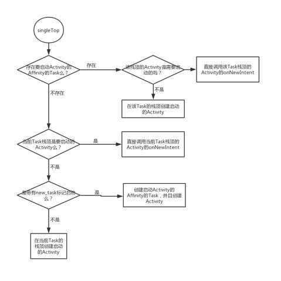


- singleTask

这是一种单实例模式，在这种模式下，只要 Activity 在一个栈中存在，那么多次启动此 Activity 都不会重新创建实例，和 singleTop一样，系统也会回调其 onNewIntent。当一个具有 singleTask 模式的Activity请求启动后，比如 Activity A，系统首先会寻找是否存在 A 想要的任务栈，如果不存在，就重新创建一个任务栈，然后创建 A 的实例后把 A 放到栈中。如果存在 A 所需的任务栈，这时要看 A 是否在栈中有实例存在，如果有实例存在，那么系统就会把 A 调到栈顶并调用它的 onNewIntent 方法，如果实例不存在，就创建 A 的实例并把 A 压入栈中 。

分析如下:

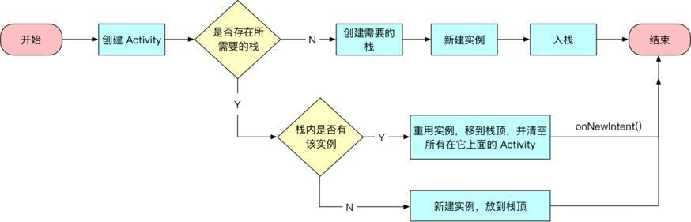


> 小提示: 此种启动模式和singleTop有点像,但是值得注意的是,下面这句话
>
> 如果存在实例则重用实例,移到栈顶,并清空所有在它上面的Activity,一般用作程序的主入口


- singleInstance

与 singleTask 相同，只是系统不会将任何其他 Activity 启动到包含实例的任务中。该 Activity 始终是其任务唯一仅有的成员；由此 Activity 启动的任何 Activity 均在单独的任务中打开。也就是有此种模式的 Activity 只能单独地位于一个任务栈中


## Intent Activity Flag 的使用

使用流程如下:

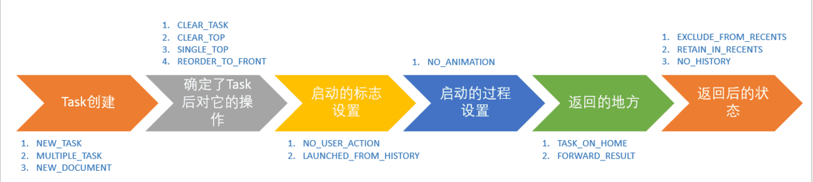

对于Intent Flag 种类太多了,这里就不一一解释了,

我们只需要知道要使用Flag的流程即可,需要用到的时候自己查一下文档

另外需要注意的是,Intent Flag的设置只对standard和singleTop这两种启动模式有效


## Activity四种启动模式的应用场景

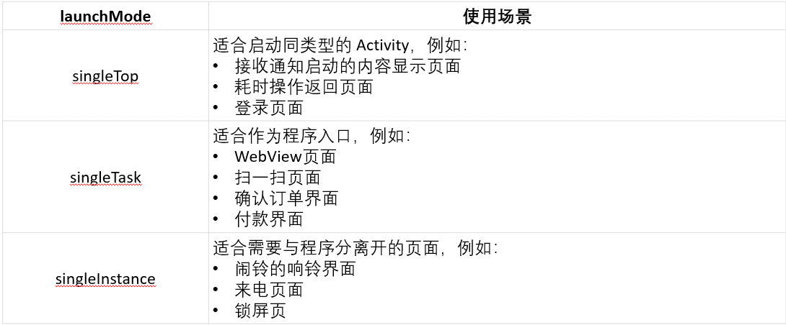


至此,anctivity的四种启动模式和生命周期分析完毕

