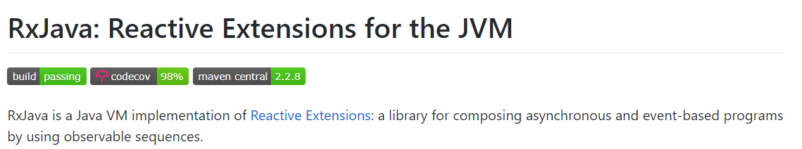

# 前言

* 官方定义:`RxJava`是一个反应性扩展的Java VM实现:一个库，用于使用可观察序列组合异步和基于事件的程序
* 特点:  `Rxjava`由于其基于事件流的链式调用、逻辑简洁 & 使用简单的特点，深受各大 Android开发者的欢迎。



## 功能
* 基于事件流实现异步操作,等同于 Android中的 AsyncTask 、Handler作用

## 特点
* 基于事件流的链式调用
*  逻辑简洁
* 实现优雅
* 使用简单
* 随着程序逻辑的复杂性提高，依然能够保持代码简洁

## 原理
* `Rxjava`原理 基于 一种扩展的观察者模式
------------------------

<!--more--> 


被观察者 （Observable） 通过 订阅（Subscribe） 按顺序发送事件 给观察者 （Observer）， 观察者（Observer） 按顺序接收事件 以及作出对应的响应动作

---------------------------------
* 被观察者（Observable）      产生事件
* 观察者（Observer）	接收事件，并给出响应动作	
* 订阅（Subscribe）	连接 被观察者 & 观察者	
* 事件（Event）	被观察者 & 观察者 连接的桥梁

## 基本使用

### 1.传统方式一

* 加入依赖
```
   implementation 'io.reactivex.rxjava2:rxjava:2.2.8'
    implementation 'io.reactivex.rxjava2:rxandroid:2.1.1'
```

* 创建被观察者 observable &产生事件
```
//  1. 创建被观察者 Observable 对象
        Observable<Integer> observable = Observable.create(new ObservableOnSubscribe<Integer>() {
            // 2. 在复写的subscribe（）里定义需要发送的事件
            @Override
            public void subscribe(ObservableEmitter<Integer> emitter) throws Exception {
                // 通过 ObservableEmitter类对象产生事件并通知观察者
                // ObservableEmitter类介绍
                    // a. 定义：事件发射器
                    // b. 作用：定义需要发送的事件 & 向观察者发送事件
                emitter.onNext(1);
                emitter.onNext(2);
                emitter.onNext(3);
                emitter.onComplete();//事件完成,可以选择继续发送事件
            }
        });
```

* 创建观察者 （Observer ）并 定义响应事件的行为
```
 Observer<Integer> observer = new Observer<Integer>() {
            // 通过复写对应方法来 响应 被观察者
            @Override
            public void onSubscribe(Disposable d) {
                Log.d(TAG, "开始连接");
            }
            // 默认最先调用复写的 onSubscribe（）

            @Override
            public void onNext(Integer value) {
                Log.d(TAG, "处理事件"+ value   );
            }

            @Override
            public void onError(Throwable e) {
                Log.d(TAG, "处理事件"+ value   );
            }
            }

            @Override
            public void onComplete() {
               Log.d(TAG, "事件完成.不在接收任何事件"  );
            }
            }
        };
```

* 通过订阅（Subscribe）连接观察者和被观察者
```
   observable.subscribe(observer);
```

### 2.基于事件流链式方式  

```
Observable.create(new ObservableOnSubscribe<Integer>() {
        // 1. 创建被观察者 & 生产事件
            @Override
            public void subscribe(ObservableEmitter<Integer> emitter) throws Exception {
                emitter.onNext(1);
                emitter.onNext(2);
                emitter.onNext(3);
                emitter.onComplete();
            }
        }).subscribe(new Observer<Integer>() {
            // 2. 通过通过订阅（subscribe）连接观察者和被观察者
            // 3. 创建观察者 & 定义响应事件的行为
            @Override
            public void onSubscribe(Disposable d) {
                Log.d(TAG, "开始采用subscribe连接");
            }
            // 默认最先调用复写的 onSubscribe（）

            @Override
            public void onNext(Integer value) {
                Log.d(TAG, "处理事件"+ value   );
            }

            @Override
            public void onError(Throwable e) {
                Log.d(TAG, "处理Error事件,不再接收事件");
            }

            @Override
            public void onComplete() {
                Log.d(TAG, "处理Complete事件,不再接收事件");
            }

        });
    }
```

* 中断连接关系   
观察者 无法继续 接收 被观察者的事件，但被观察者还是可以继续发送事件

```
// 主要在观察者 Observer中 实现
        Observer<Integer> observer = new Observer<Integer>() {
            // 1. 定义Disposable类变量
            private Disposable mDisposable;

            @Override
            public void onSubscribe(Disposable d) {
                Log.d(TAG, "开始采用subscribe连接");
                // 2. 对Disposable类变量赋值
                mDisposable = d;
            }

            @Override
            public void onNext(Integer value) {
                Log.d(TAG, "对Next事件"+ value +"作出响应"  );
                if (value == 2) {
                    // 设置在接收到第二个事件后切断观察者和被观察者的连接
                    mDisposable.dispose();
                    Log.d(TAG, "已经中段了连接：" + mDisposable.isDisposed());
                }
            }

            @Override
            public void onError(Throwable e) {
                Log.d(TAG, "处理Error事件");     //无法收到Error事件了
            }

            @Override
            public void onComplete() {
                Log.d(TAG, "处理Complete事件");//无法收到Complete事件了
            }
        };
```


## 总结
* `Rxjava`原理 基于 一种扩展的观察者模式
------------------------
被观察者 （Observable） 通过 订阅（Subscribe） 按顺序发送事件 给观察者 （Observer）， 观察者（Observer） 按顺序接收事件 以及作出对应的响应动作

---------------------------------
* 被观察者（Observable）      产生事件
* 观察者（Observer）	接收事件，并给出响应动作	
* 订阅（Subscribe）	连接 被观察者 & 观察者	
* 事件（Event）	被观察者 & 观察者 连接的桥梁

至此,Rxjava的基本介绍和使用就完成了,感谢阅读

## 参考文章:
[Android Rxjava：这是一篇 清晰 & 易懂的Rxjava 入门教程](https://www.jianshu.com/p/a406b94f3188)


欢迎关注作者[darryrzhong](http://www.darryrzhong.site),更多干货等你来拿哟.

### 请赏个小红心！因为你的鼓励是我写作的最大动力！
>更多精彩文章请关注
- [个人博客:darryrzhong](http://www.darryrzhong.xyz)
- [掘金](https://juejin.im/user/5a6c3b19f265da3e49804988)
- [简书](https://www.jianshu.com/users/b7fdf53ec0b9/timeline)
- [SegmentFault](https://segmentfault.com/u/darryrzhong_5ac59892a5882/articles)
- [慕课网手记](https://www.imooc.com/u/6733207)


