# 前言

> 在 Android 开发中，内存泄漏这个名词我想大家都不陌生，但是真正注意到这个问题并去解决的估计很少，因为内存泄漏表面上并不会表现出对app的任何影响，加之现在的手机配置与内存都挺高的，所以对于中小型app来说，可能不怎么去处理也几乎看不出来，但是作为一名android 开发者，你肯定和我一样不能忍受这种瑕疵吧，那 就撸起袖子干它就完事了


## 内存抖动 & 内存泄漏 & 内存溢出（OOM）

###  内存抖动

 > 含义：短时间内有大量对象创建销毁，它伴随着频繁的GC。


 1. 查看：可以使用android studio自带的profile工具检测。

 2. 现象：在profile中的内存图像就像是心电图一样，忽上忽下，如下图所示：


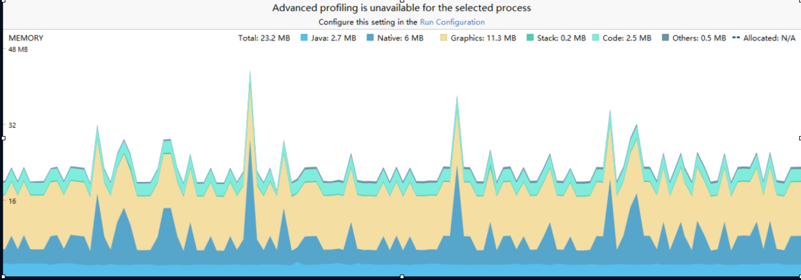


 3. 常见场景：循环使用字符串拼接，比如我们项目的日志打印等

 4. 预防内存抖动方法：

 - 避免在循环中创建对象，能复用的尽量复用。
 - 避免在频繁调用的方法中创建对象，如自定义view中的onDraw（）等方法中创建画笔。
 - 获取对象尽量从对象池中获取，如Handler获取Message对象应使用obtain（）方法获取了。
 - 


### 内存泄漏


> 程序中己动态分配的堆内存由于某种原因程序未释放或无法释放，造成系统内存的浪费。
> 长生命周期对象持有短生命周期对象强引用，从而导致短生命周期对象无法被回收！

1. 查看：使用profile工具检测内存情况，重复执行进入然后退出一个activity，看activity实例是否还存在。如果activity实例还存在，很可能就出现了内存泄漏。

2. 现象：反复进入A，然后退出A ，执行三次，可以看到A 的实例存在两个。如下图，VideoPlayerActivity：


这就说明我们的activity并没有被销毁，至少目前是这样的。至于究竟会不会内存泄漏，就需要接下来使用另一款工具配合使用了。


<!--more-->


3. 如何判断内存泄漏:

- 使用可达性分析法

> 通过一系列称为“GC Roots”的对象作为起始点，从这些节点向下搜索，搜索所有的引用链，当一个对象到GC Roots没有任何引用链（即GC Roots到对象不可达）时，则证明此对象是不可用的。也就会被回收。


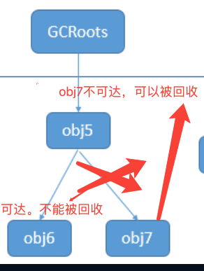

4. 何为GC Roots 对象，一般静态变量就是gc root对象，可以理解成生命周期很长的对象。

5. 如何预防内存泄漏：

- 使用 软引用、弱引用间接的持有对象的引用。

- 软引用：

> 定义一些还有用但并非必须的对象。对于软引用关联的对象，GC不会直接回收，而是在系统将要内存溢出之前才会触发GC将这些对象进行回收。


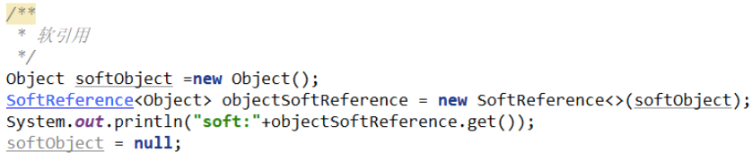


- 弱引用 ：

> 同样定义非必须对象。被弱引用关联的对象在GC执行时会被直接回收。


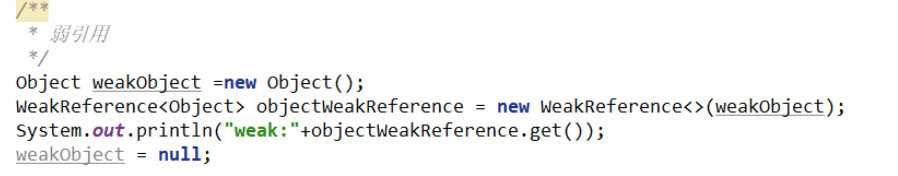

6. 造成内存泄漏的常见场景：

- 使用集合时，例如add一个监听器，我们必须要手动remove掉。
- 使用静态成员变量/单利对象时，如果持有短生命周期对象的引用（Activity）将导致短生命周期对象无法被释放。
- 进行文件io操作时，没有close（）。最好写在finally{ }里面；
- android 系统bug、第三方类库造成的内存泄漏。


### 内存溢出

> 内存溢出(Out Of Memory，简称OOM)是指应用系统中存在无法回收的内存或使用的内存过多，最终使得程序运行要用到的内存大于能提供的最大内存。此时程序就运行不了，系统会提示内存溢出，有时候会自动关闭软件，重启电脑或者软件后释放掉一部分内存又可以正常运行该软件


- 频繁的出现内存抖动或者大量内存泄漏很有可能就会导致内存溢出（OOM）。


 ## Android 中的垃圾回收器 CMS 

 >  android 中使用的垃圾回收器 叫做CMS ,下面简单介绍下他的垃圾回收算法。

 - 新生代对象

新生代对象采用的是复制算法，当大对象也可能直接进入老年代。

- 老年代对象 

老年代对象采用的是标记-清除算法，所以频繁的内存抖动，会造成内存碎片化，最后可能我们需要加载一个大对象的时候，就OOM 了。

简单介绍下CMS垃圾回收算法，如果不熟悉的建议请先百度jvm 垃圾回收机制相关知识。


## 实战 内存泄漏

### 配置环境

- android studio 
- eclipse memory analyzer (mat)

#### 下载mat

- [下载地址点我](https://www.eclipse.org/mat/)

选择相应版本进行下载安装。


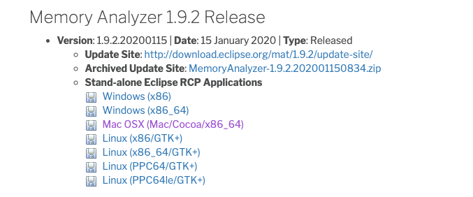

- 配置mat 环境，因为从 android profile直接获取到的hprof文件格式与mat的格式不兼容，所以需要使用工具转换一下


 > win 环境配置，请自行百度，由于本人用的Mac 所以这里只写Mac的配置


1. 打开终端输入：echo $HOME
2. 继续输入：touch .bash_profile
3. 继续输入： open -e .bash_profile
4. 在打开的bash文件中输入： export PATH=${PATH}:/Users/用户名/你的sdk路径/platform-tools
5. 最后输入： source .bash_profile
6. 没有6了，已经成功配置了。


### 使用profile获取内存分析文件


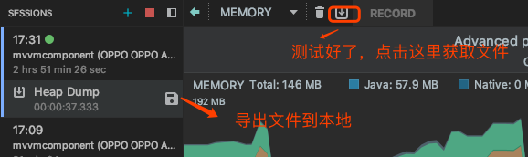


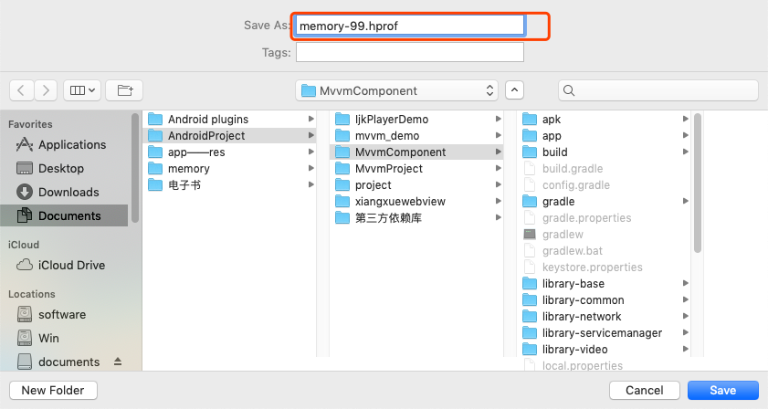

名字随便了，怎么方便怎么来

打开终端，进行文件转换 

转换格式 ： hprof-conv before.hprof after.hprof  

我们这里输入 ： hprof-conv memory-99.hprof 66.hprof 
能看懂吧，吧我们的源文件 -99 转换成 -66文件，

> 注意了 ： 需要进入-99 所在的文件目录，要不然会报错找不到文件

打开mat工具，导入我们的-66 文件


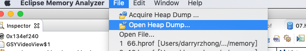

打开后可以看到这样的界面


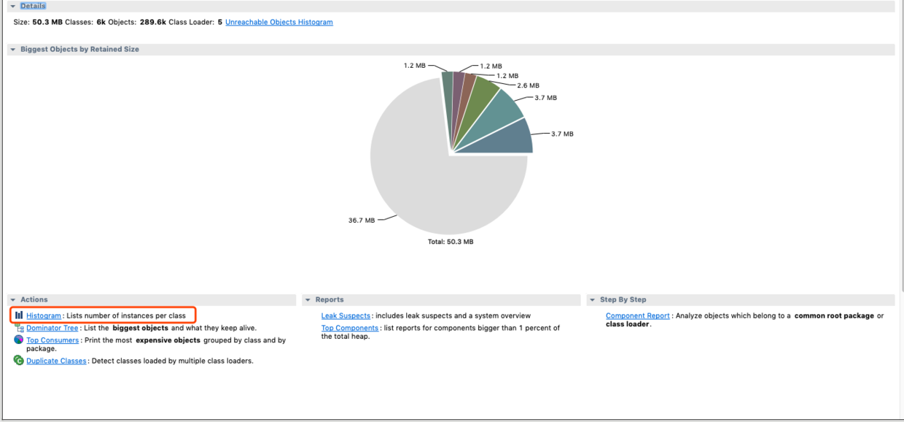

点击红框的选项，这个是进行内存泄漏分析的

下面就是这段时间所产生的对象，点击红框 可以直接搜索你要分析的对象


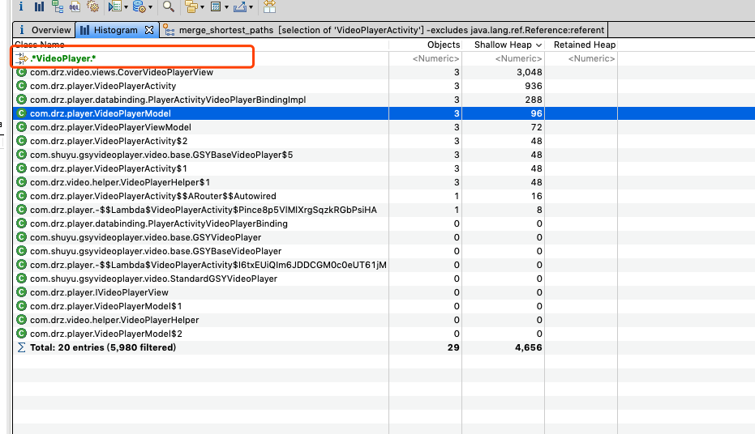

这里找到了我们的VideoPlayerActivity

鼠标右键选择


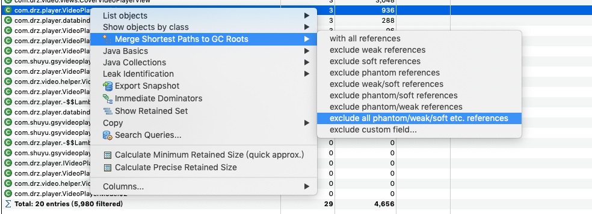

可以看到，意思就是我们排除掉软、弱、虚引用，因为这几种是不会造成内存泄漏的，可以不用管它，我们只需要看排除后还有没引用存在，有的话 那就是强引用了，也就发生了内存泄漏了。

继续看我们的结果：

点击后，发现里面存在数据，那就说明我们有内存泄漏发生了，也就是为什么上面我们已经退出了，profile里面还有三个activity的存在，刚刚上面那张图右侧也有显示有3个activity对象存在。

我们一一展开，看看到底哪里内存泄漏了


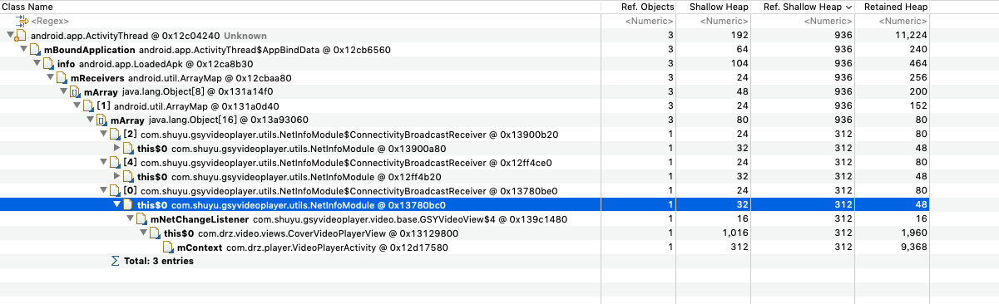

可以看到，我们的Avtivity 作为mContext 变量被我们的自定义CoverVideoPlayerView 持有了，那也就是说，因为我们的自定义View不能被gc回收，所以activity也无法被回收。

那就继续看，为什么自定义view无法被回收，可以看到，this$0，这表示在自定义view的内部有一个非静态内部类，而非静态内部类是默认持有外部类的引用的，也就是我们的，mNetChangeListener对象，这个就熟悉了吧，肯定是new 一个匿名内部类啊，

继续看，这个内部类又被NetInfoModeule引用了，我丢，然后继续往上看，我就不看了，你自己看吧

我去喝杯水，你慢慢看吧

啥？ 我喝完回来了，你还没看完呢？ 那还是我们一起看吧，

继续往上的话，可以看到 NetInfoModeule又被什么xxxxxBroadcastReceiver 引用了，那不就是广播吗? 猜想，肯定又是一个非静态内部类了，在往上看

咳咳，别看了，上面和我们没啥关系了，全是系统在搞事情了，

通过上面一波分析，我们应该清楚了，泄漏的原因了，

然后梳理一下：

VideoPlayerActivity -> mContext -> CoverVideoPlayerView -> mNetChangeListener ->  NetInfoModeule -> xxxxxBroadcastReceiver;

引用链找到了，所以，我们把链条给整段了，就不会内存泄漏了啊

怎么段呢？

最简单的方式： 假如啊 ，这些个不靠谱的代码都是你自己写的，那好办

```
在activity 的onDestory（）方法中加上，

1.CoverVideoPlayerView.;

2.在CoverVideoPlayerView方法中，添加个cancel（）方法，
加上  
  mContext = null
  mNetChangeListener = null；
  NetInfoModeule = null；
  然后广播记得unregister（）一下，这样不就完事了。
 
```

嗯，一切都入想象的那般甜美，but，残酷的事实摆在眼前，这特么是第三方库的代码，你咋改？
下源码改? 得 ，可行是可行，那要是很多个库呢？ 你还下不？还改不？

算了，不改了，嗯也行，反正也好像没啥影响，而且我们的VideoPlayerActivity用的SingleTop 启动模式，
但是你如果用户不是在播放页面点击跳转的呢，退出再进来，退出再进来，最后十几个activity的实例，
连带着我们的model 、viewmodel 、统统都是十几份，你确定你不会被老大拿出去祭天？

界面如下：


那要怎么改呢? 你说说呗，

改当然能改了，那就是用java反射，通过反射去拿到对象，进行修改，

直接上代码吧

```
  /**
     * 利用反射 解决gsy库中导致的内存泄漏
     */
    public void cancel()
    {
        mAudioManager.abandonAudioFocus(onAudioFocusChangeListener);
        try
        {
            // 拿到NetInfoModule对象中 mConnectivityBroadcastReceiver字段.
            Field mConnectivityBroadcastReceiver = NetInfoModule.class
                .getDeclaredField("mConnectivityBroadcastReceiver");
            // 由于是私有字段,所以需要调用setAccessible(true),否则会报错
            mConnectivityBroadcastReceiver.setAccessible(true);
            // 根据当前mNetInfoModule对象的 mConnectivityBroadcastReceiver字段值为null
            mConnectivityBroadcastReceiver.set(mNetInfoModule, null);
            Field mNetChangeListener =
                NetInfoModule.class.getDeclaredField("mNetChangeListener");
            mNetChangeListener.setAccessible(true);
            mNetChangeListener.set(mNetInfoModule, null);
            
        }
        catch (NoSuchFieldException e)
        {
            e.printStackTrace();
        }
        catch (IllegalAccessException e)
        {
            e.printStackTrace();
        }
        mAudioManager = null;
        mContext = null;
    }
    
    
```

好了，改完了，我们在来抓一下内存情况

直接上图：


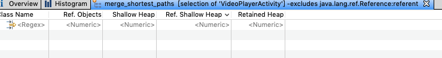


看见没有，啥也没有了，说明我们的activiy再没有被其他对象引用了，说的不对，纠正一下，是没有被其他对象强引用了，而只要没有强引用关系，gc肯定能够回收的，自然你就也不需要担心内存泄漏了，

但是为什么还是会显示有3个activity对象存在呢？


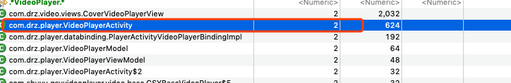

那我们排除一下弱应用，看一看


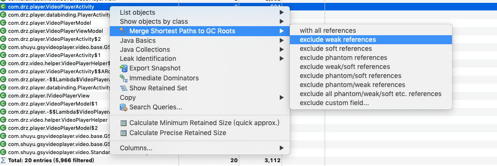


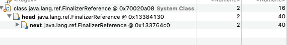

看见没有，这里有一个FinalizeRefernce对象，说明我们的activity被FinalizeRefernce对象所引用，而我们知道，只要一个对象将要被gc回收了，那么他就会被这个FinalizeRefernce所引用，这是为了让gc知道我们不需要这个对象了，你可以回收了，

所以我们的activity 虽然显示有两个，但是只是gc还没来的及回收而已，并没有内存泄漏的风险。


上面的例子是我的开源项目里的真实实例，感兴趣的可以前往支持 start 一下，

## 项目地址 
- # **[Android-MvvmComponent-App](https://github.com/darryrzhong/Android-MvvmComponent-App)**


## 总结

> 内存抖动的分析用profile工具完全就够用了，当然我们这里没有详讲怎么用profile分析解决内存抖动，之后有时间在补上吧。而我们的内存泄漏通过profile是不能看出他到底有没有发生内存泄漏的，所以我们还需要借助mat工具进一步分析。

当然还有一些第三方的检测库，比较知名的比如leakCannary工具，腾讯的xxxdog，但是个人还是推荐使用mat来分析，mat操作起来也很方便，好了，今天就到这吧，感谢！


> 欢迎关注作者[darryrzhong](http://www.darryrzhong.xyz),更多干货等你来拿哟.

### 请赏个小红心！因为你的鼓励是我写作的最大动力！
>更多精彩文章请关注
- [个人博客:darryrzhong](http://www.darryrzhong.xyz)
- [掘金](https://juejin.im/user/5a6c3b19f265da3e49804988)
- [简书](https://www.jianshu.com/users/b7fdf53ec0b9/timeline)
- [SegmentFault](https://segmentfault.com/u/darryrzhong_5ac59892a5882/articles)
- [慕课网手记](https://www.imooc.com/u/6733207)