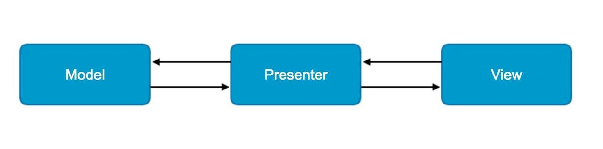

# Dagger2

Dagger2起源于Dagger，是一款基于Java注解来实现的完全在编译阶段完成依赖注入的开源库，主要用于模块间解耦、提高代码的健壮性和可维护性。Dagger2在编译阶段通过apt利用Java注解自动生成Java代码，然后结合手写的代码来自动帮我们完成依赖注入的工作。

起初Square公司受到Guice的启发而开发了Dagger，但是Dagger这种半静态半运行时的框架还是有些性能问题（虽说依赖注入是完全静态的，但是其有向无环图(Directed Acyclic Graph)还是基于反射来生成的，这无论在大型的服务端应用还是在Android应用上都不是最优方案）。因此Google工程师Fork了Dagger项目，对它进行了改造。于是变演变出了今天我们要讨论的Dagger2，所以说Dagger2其实就是高配版的Dagger。

### Dagger2注解

Dagger2是基于Java注解来实现依赖注入的，那么在正式使用之前我们需要先了解下Dagger2中的注解。Dagger2使用过程中我们通常接触到的注解主要包括：@Inject, @Module, @Provides, @Component, @Qulifier, @Scope, @Singleten。

- @Inject：@Inject有两个作用，一是用来标记需要依赖的变量，以此告诉Dagger2为它提供依赖；二是用来标记构造函数，Dagger2通过@Inject注解可以在需要这个类实例的时候来找到这个构造函数并把相关实例构造出来，以此来为被@Inject标记了的变量提供依赖；
- @Module：@Module用于标注提供依赖的类。你可能会有点困惑，上面不是提到用@Inject标记构造函数就可以提供依赖了么，为什么还需要@Module？很多时候我们需要提供依赖的构造函数是第三方库的，我们没法给它加上@Inject注解，又比如说提供以来的构造函数是带参数的，如果我们之所简单的使用@Inject标记它，那么他的参数又怎么来呢？@Module正是帮我们解决这些问题的。
- @Provides：@Provides用于标注Module所标注的类中的方法，该方法在需要提供依赖时被调用，从而把预先提供好的对象当做依赖给标注了@Inject的变量赋值；
- @Component：@Component用于标注接口，是依赖需求方和依赖提供方之间的桥梁。被Component标注的接口在编译时会生成该接口的实现类（如果@Component标注的接口为CarComponent，则编译期生成的实现类为DaggerCarComponent）,我们通过调用这个实现类的方法完成注入；
- @Qulifier：@Qulifier用于自定义注解，也就是说@Qulifier就如同Java提供的几种基本元注解一样用来标记注解类。我们在使用@Module来标注提供依赖的方法时，方法名我们是可以随便定义的（虽然我们定义方法名一般以provide开头，但这并不是强制的，只是为了增加可读性而已）。那么Dagger2怎么知道这个方法是为谁提供依赖呢？答案就是返回值的类型，Dagger2根据返回值的类型来决定为哪个被@Inject标记了的变量赋值。但是问题来了，一旦有多个一样的返回类型Dagger2就懵逼了。@Qulifier的存在正式为了解决这个问题，我们使用@Qulifier来定义自己的注解，然后通过自定义的注解去标注提供依赖的方法和依赖需求方（也就是被@Inject标注的变量），这样Dagger2就知道为谁提供依赖了。----一个更为精简的定义：当类型不足以鉴别一个依赖的时候，我们就可以使用这个注解标示；
- @Scope：@Scope同样用于自定义注解，我能可以通过@Scope自定义的注解来限定注解作用域，实现局部的单例；
- @Singleton：@Singleton其实就是一个通过@Scope定义的注解，我们一般通过它来实现全局单例。但实际上它并不能提前全局单例，是否能提供全局单例还要取决于对应的Component是否为一个全局对象。

我们提到@Inject和@Module都可以提供依赖，那如果我们即在构造函数上通过标记@Inject提供依赖，有通过@Module提供依赖Dagger2会如何选择呢？具体规则如下：

- 步骤1：首先查找@Module标注的类中是否存在提供依赖的方法。
- 步骤2：若存在提供依赖的方法，查看该方法是否存在参数。
- - a：若存在参数，则按从步骤1开始依次初始化每个参数；
  - b：若不存在，则直接初始化该类实例，完成一次依赖注入。


- 步骤3：若不存在提供依赖的方法，则查找@Inject标注的构造函数，看构造函数是否存在参数。
- - a：若存在参数，则从步骤1开始依次初始化每一个参数
  - b：若不存在，则直接初始化该类实例，完成一次依赖注入。


<!--more-->


### Dagger2使用入门

**1、案例A**

Car类是需求依赖方，依赖了Engine类；因此我们需要在类变量Engine上添加@Inject来告诉Dagger2来为自己提供依赖。
Engine类是依赖提供方，因此我们需要在它的构造函数上添加@Inject

```java
public class Engine {

    /**
     * 二是用来标记构造函数，Dagger2通过@Inject注解可以在需要这个类实例的时候来找到这个构造函数并把相关实例构造出来，
     * 以此来为被@Inject标记了的变量提供依赖
     */
    @Inject
    Engine(){}

    @Override
    public String toString() {
        return "Engine{}";
    }

    public void run(){
        System.out.println("引擎转起来了~~~");
    }
}
```

接下来我们需要创建一个用@Component标注的接口CarComponent，这个CarComponent其实就是一个注入器，这里用来将Engine注入到Car中。

```java
@Component
public interface CarComponent {
    void inject(Car car);
}
```

完成这些之后我们需要Build下项目，让Dagger2帮我们生成相关的Java类。接着我们就可以在Car的构造函数中调用Dagger2生成的DaggerCarComponent来实现注入（这其实在前面Car类的代码中已经有了体现）

```java
public class Car {
    /**
     * @Inject：@Inject有两个作用，一是用来标记需要依赖的变量，以此告诉Dagger2为它提供依赖
     */
    @Inject
    Engine engine;

    public Car() {
        DaggerCarComponent.builder().build().inject(this);
    }

    public Engine getEngine() {
        return this.engine;
    }

    public static void main(String ... args){
        //TODO:
        Car car = new Car();
        System.out.println(car.getEngine());
    }
}
```

**2、案例B**

如果创建Engine的构造函数是带参数的呢？比如说制造一台引擎是需要齿轮(Gear)的。或者Eggine类是我们无法修改的呢？这时候就需要@Module和@Provide上场了。

同样我们需要在Car类的成员变量Engine上加上@Inject表示自己需要Dagger2为自己提供依赖；Engine类的构造函数上的@Inject也需要去掉，应为现在不需要通过构造函数上的@Inject来提供依赖了。

```java
public class Engine {

    private String name;

    @Inject
    Engine(){}

    Engine(String name) {
        this.name = name;
    }

    @Override
    public String toString() {
        return "Engine{" +
                "name='" + name + '\'' +
                '}';
    }

    public void run() {
        System.out.println("引擎转起来了~~~");
    }
}
```

接着我们需要一个Module类来生成依赖对象。前面介绍的@Module就是用来标准这个类的，而@Provide则是用来标注具体提供依赖对象的方法（这里有个不成文的规定，被@Provide标注的方法命名我们一般以provide开头，这并不是强制的但有益于提升代码的可读性）。

```java
@Module
public class MarkCarModule {

    public MarkCarModule(){ }

    /**
     * 用于标注Module所标注的类中的方法，该方法在需要提供依赖时被调用，从而把预先提供好的对象当做依赖给标注了@Inject的变量赋值
     * @return
     */
    @Provides
    Engine provideEngine(){
        return new Engine("gear");
    }
}
```

接下来我们还需要对CarComponent进行一点点修改，之前的@Component注解是不带参数的，现在我们需要加上modules = {MarkCarModule.class}，用来告诉Dagger2提供依赖的是MarkCarModule这个类。

```java
@Component(modules = MarkCarModule.class)
public interface CarComponent {
    void inject(Car car);
}
```

Car类的构造函数我们也需要修改，相比之前多了个markCarModule(new MarkCarModule())方法，这就相当于告诉了注入器DaggerCarComponent把MarkCarModule提供的依赖注入到了Car类中。

```java
public class Car {
    /**
     * 我们提到@Inject和@Module都可以提供依赖，那如果我们即在构造函数上通过标记@Inject提供依赖，有通过@Module提供依赖Dagger2会如何选择呢？具体规则如下：
     *
     * 步骤1：首先查找@Module标注的类中是否存在提供依赖的方法。
     * 步骤2：若存在提供依赖的方法，查看该方法是否存在参数。
     * a：若存在参数，则按从步骤1开始依次初始化每个参数；
     * b：若不存在，则直接初始化该类实例，完成一次依赖注入。
     *
     *
     * 步骤3：若不存在提供依赖的方法，则查找@Inject标注的构造函数，看构造函数是否存在参数。
     * a：若存在参数，则从步骤1开始依次初始化每一个参数
     * b：若不存在，则直接初始化该类实例，完成一次依赖注入
     */
    @Inject
    Engine engine;

    public Car() {
        DaggerCarComponent.builder().markCarModule(new MarkCarModule())
                .build().inject(this);
    }

    public Engine getEngine() {
        return this.engine;
    }

    public static void main(String ... args){
        //TODO:
        Car car = new Car();
        System.out.println(car.getEngine());
    }
}
```

这样一个最最基本的依赖注入就完成了，接下来我们测试下我们的代码。
输出

```text
Engine{name='gear'}
```

**3、案例C**

那么如果一台汽车有两个引擎（也就是说Car类中有两个Engine变量）怎么办呢？没关系，我们还有@Qulifier！首先我们需要使用Qulifier定义两个注解：

```java
public class Engine {

    /**
     * 用于自定义注解，也就是说@Qulifier就如同Java提供的几种基本元注解一样用来标记注解类。我们在使用@Module来标注提供依赖的方法时，方法名我们是可以随便定义的（虽然我们定义方法名一般以provide开头，但这并不是强制的，只是为了增加可读性而已）。那么Dagger2怎么知道这个方法是为谁提供依赖呢？答案就是返回值的类型，Dagger2根据返回值的类型来决定为哪个被@Inject标记了的变量赋值。但是问题来了，一旦有多个一样的返回类型Dagger2就懵逼了。@Qulifier的存在正式为了解决这个问题，我们使用@Qulifier来定义自己的注解，然后通过自定义的注解去标注提供依赖的方法和依赖需求方（也就是被@Inject标注的变量），这样Dagger2就知道为谁提供依赖了。----一个更为精简的定义：当类型不足以鉴别一个依赖的时候，我们就可以使用这个注解标示
     * 1. 使用@Qulifier定义两个注解
     */
    @Qualifier
    @Retention(RetentionPolicy.RUNTIME)
    public @interface QualifierA { }
    @Qualifier
    @Retention(RetentionPolicy.RUNTIME)
    public @interface QualifierB { }

    private String name;

    Engine(String name) {
        this.name = name;
    }

    @Override
    public String toString() {
        return "Engine{" +
                "name='" + name + '\'' +
                '}';
    }

    public void run() {
        System.out.println("引擎转起来了~~~");
    }
}
```

同时我们需要对依赖提供方做出修改

```java
@Module
public class MarkCarModule {

    public MarkCarModule(){ }

    /**
     * 2. 同时我们需要对依赖提供方做出修改
     * @return
     */
    @Engine.QualifierA
    @Provides
    Engine provideEngineA(){
        return new Engine("gearA");
    }

    @Engine.QualifierB
    @Provides
    Engine provideEngineB(){
        return new Engine("gearB");
    }
}
```

接下来依赖需求方Car类同样需要修改

```java
public class Car {
    /**
     * 3. 接下来依赖需求方Car类同样需要修改
     */
    @Engine.QualifierA
    @Inject
    Engine engineA;

    @Engine.QualifierB
    @Inject
    Engine engineB;

    public Car() {
        DaggerCarComponent.builder().markCarModule(new MarkCarModule())
                .build().inject(this);
    }

    public Engine getEngineA() {
        return this.engineA;
    }

    public Engine getEngineB() {
        return this.engineB;
    }

    public static void main(String... args) {
        //TODO:
        Car car = new Car();
        System.out.println(car.getEngineA());
        System.out.println(car.getEngineB());
    }
}
```

执行结果：

```text
Engine{name='gearA'}
Engine{name='gearB'}
```

**4、案例D**
接下来我们看看@Scope是如何限定作用域，实现局部单例的。
首先我们需要通过@Scope定义一个CarScope注解：

```java
public class Engine {


    /**
     * 用于自定义注解，我能可以通过@Scope自定义的注解来限定注解作用域，实现局部的单例
     * 1. @Scope定义一个CarScope注解
     */
    @Scope
    @Retention(RetentionPolicy.RUNTIME)
    public @interface CarScope {
    }

    private String name;

    Engine(String name) {
        this.name = name;
        System.out.println("Engine create: " + name);
    }

    @Override
    public String toString() {
        return "Engine{" +
                "name='" + name + '\'' +
                '}';
    }

    public void run() {
        System.out.println("引擎转起来了~~~");
    }
}
```

接着我们需要用这个@CarScope去标记依赖提供方MarkCarModule。

```java
@Module
public class MarkCarModule {

    public MarkCarModule(){ }

    /**
     * 2. @CarScope去标记依赖提供方MarkCarModule
     * @return
     */
    @Engine.CarScope
    @Provides
    Engine provideEngine(){
        return new Engine("gear");
    }

}
```

同时还需要使用@Scope去标注注入器Compoent

```java
/**
 * 3. 同时还需要使用@Scope去标注注入器Compoent
 */
@Engine.CarScope
@Component(modules = MarkCarModule.class)
public interface CarComponent {
    void inject(Car car);
}
```

```java
public class Car {

    @Inject
    Engine engineA;

    @Inject
    Engine engineB;

    public Car() {
        DaggerCarComponent.builder().markCarModule(new MarkCarModule())
                .build().inject(this);
    }

    public Engine getEngineA() {
        return this.engineA;
    }

    public Engine getEngineB() {
        return this.engineB;
    }

    public static void main(String... args) {
        //TODO:
        Car car = new Car();
        System.out.println(car.getEngineA());
        System.out.println(car.getEngineB());
    }
}
```

如果我们不适用@Scope,上面的代码会实例化两次Engine类，因此会有两次"Create Engine"输出。现在我们在有@Scope的情况测试下劳动成果：
输出

```text
Engine create: gear
Engine{name='gear'}
Engine{name='gear'}
```

# Dagger与MVP

　对于一个应用而言我们需要对它抽象出各个层面，而在MVP架构中它将UI界面和数据进行隔离，所以我们的应用也就分为三个层次。

- View: 对于View层也是视图层，在View层中只负责对数据的展示，提供友好的界面与用户进行交互。在Android开发中通常将Activity或者Fragment作为View层。
- Model: 对于Model层也是数据层。它区别于MVC架构中的Model，在这里不仅仅只是数据模型。在MVP架构中Model它负责对数据的存取操作，例如对数据库的读写，网络的数据的请求等。
- Presenter:对于Presenter层他是连接View层与Model层的桥梁并对业务逻辑进行处理。在MVP架构中Model与View无法直接进行交互。所以在Presenter层它会从Model层获得所需要的数据，进行一些适当的处理后交由View层进行显示。这样通过Presenter将View与Model进行隔离，使得View和Model之间不存在耦合，同时也将业务逻辑从View中抽离。

　　下面通过MVP结构图来看一下MVP中各个层次之间的关系。 



在MVP架构中将这三层分别抽象到各自的接口当中。通过接口将层次之间进行隔离，而Presenter对View和Model的相互依赖也是依赖于各自的接口。这点符合了接口隔离原则，也正是面向接口编程。在Presenter层中包含了一个View接口，并且依赖于Model接口，从而将Model层与View层联系在一起。而对于View层会持有一个Presenter成员变量并且只保留对Presenter接口的调用，具体业务逻辑全部交由Presenter接口实现类中处理。

如果你的项目是采用MVP架构的，那么结合Dagger2将会是一件非常棒的体验，它让M-V-P进一步解藕，架构更清晰。