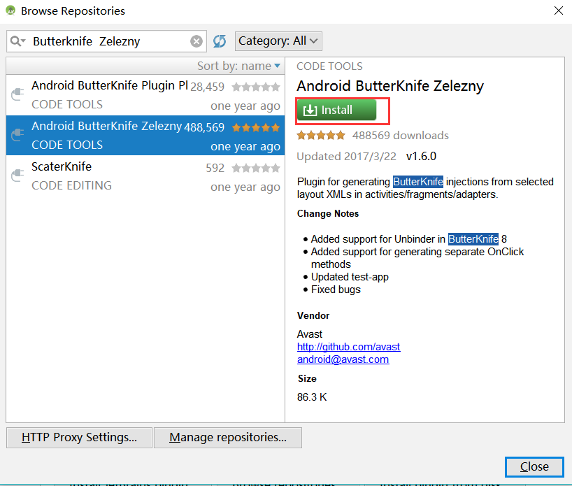
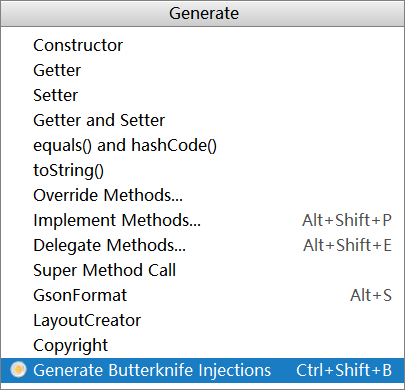
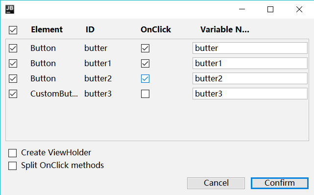

# Butterknife简介
[Butterknife](https://github.com/JakeWharton/butterknife)中文又名黄油刀,是 [JakeWharton](https://github.com/JakeWharton)大神开源的一款`Android视图的字段和方法绑定`快速注解框架.也是Android开发中比较常用的一款快速注解框架了,可以不用不断的重复`findViewById`,在各种场合下快速绑定view的多种事件,大大提高了开发的效率.
> 为什么开发用Butterknife?

1、强大的View绑定和Click事件处理功能，简化代码，提升开发效率
2、方便的处理Adapter里的ViewHolder绑定问题
3、运行时不会影响APP效率，使用配置方便
4、代码清晰，可读性强
5、............

>  使用配置
## 在 Android studio 项目中配置:Butterknife:

## 一.在主Moduel中的`build.gradle`中添加如下配置:

```
dependencies {
    
    implementation 'com.jakewharton:butterknife:8.8.1'
    annotationProcessor 'com.jakewharton:butterknife-compiler:8.8.1'
}
```
简单使用如下:
```
class ExampleActivity extends Activity {
  @BindView(R.id.user) EditText username;
  @BindView(R.id.pass) EditText password;

  @BindString(R.string.login_error) String loginErrorMessage;

  @OnClick(R.id.submit) void submit() {
    // TODO call server...
  }

  @Override public void onCreate(Bundle savedInstanceState) {
    super.onCreate(savedInstanceState);
    setContentView(R.layout.simple_activity);
    ButterKnife.bind(this);
    // TODO Use fields...
  }
}
```

<!--more-->

## 二.在Library projects中使用(按个人需求而定)
1.在 Android project的`build.gradle`中添加如下配置:
```
buildscript {
  repositories {
    mavenCentral()
   }
  dependencies {
    classpath 'com.jakewharton:butterknife-gradle-plugin:8.8.1'
  }
}
```
2.在Library的`build.gradle`中添加如下配置:
```
apply plugin: 'com.android.library'
apply plugin: 'com.jakewharton.butterknife'
```
>值得注意的是,在Library中使用Butterknife注解使用的是R2.而不是R.

如下:
```
class ExampleActivity extends Activity {
  @BindView(R2.id.user) EditText username;
  @BindView(R2.id.pass) EditText password;
...
}
```

#  ButterKnife的基本使用详解

>  ButterKnife使用场景如下:

1.在Activity中绑定ButterKnife:
```
public class MainActivity extends AppCompatActivity {
  @BindView(R.id.butter)
    Button button;


    @Override
    protected void onCreate(Bundle savedInstanceState) {
        super.onCreate(savedInstanceState);
        setContentView(R.layout.activity_main);
        ButterKnife.bind(this);
    }

    @OnClick(R.id.butter)
    public void onClick(){
        Log.e("111111","11111");
        Toast.makeText(this, "绑定单个view事件", Toast.LENGTH_SHORT).show();
    }
}
```
> 值得注意的是:ButterKnife.bind(this)必须在初始化绑定布局文件之后,否则会报错

2.在Fragment中绑定ButterKnife:
```
public class ExampleFragment extends Fragment {

    private Unbinder unbinder;
    @BindView(R.id.example)
    Button example;

    @Nullable
    @Override
    public View onCreateView(LayoutInflater inflater, @Nullable ViewGroup container, @Nullable Bundle savedInstanceState) {
       View view = View.inflate(getContext(),R.layout.fragment_example,null);
        unbinder = ButterKnife.bind(this,view);
        return view;

    }

    @Override
    public void onDestroyView() {
        super.onDestroyView();
        unbinder.unbind();//视图销毁时必须解绑
    }
}
```
> 值得注意的是:在Fragment中需要在视图销毁时解绑Butterknife,否则会造成内存泄漏.

3.在Adapter的ViewHolder中绑定Butterknife:
```
 @NonNull
    @Override
    public MyViewHolder onCreateViewHolder(@NonNull ViewGroup parent, int viewType) {
        View itemView = LayoutInflater.from(parent.getContext()).inflate(R.layout.recy_dynamic_state_item,parent,false);
        MyViewHolder myViewHolder = new MyViewHolder(itemView);//此处将view传入
        itemView.setOnClickListener(this);
        return myViewHolder;
    }

public class MyViewHolder extends RecyclerView.ViewHolder {
         @BindView(R.id.iv_photo)
        SimpleDraweeView simpleDraweeView;
         @BindView(R.id.tv_title)
        TextView tvTitle;
         @BindView(R.id.tv_detail)
         TextView tvDetail;
         @BindView(R.id.date)
         TextView date;
         @BindView(R.id.avatar_user)
         SimpleDraweeView avatarUser;
         @BindView(R.id.username)
         TextView userName;

         public MyViewHolder(View itemView) {
             super(itemView);
             ButterKnife.bind(this,itemView);//此处进行绑定
         }
```

##  Butterknife具体使用

### 绑定View：
1.单个控件id 注解： @BindView（）

```
@BindView(R.id.example)
    Button example;
```
2.布局内多个控件id 注解： @BindViews（）
```
@BindViews({R.id.butter,R.id.butter1,R.id.butter2})
    List<Button> buttons;
```
### 绑定资源文件
1.绑定string 字符串：@BindString()
```
@BindString(R.string.app_name) //绑定资源文件中string字符串
String name;
```
2.绑定array数组：@BindArray()
```
<resources>
<string name="app_name">开眼视频</string>

<string-array name="weather">
<item>高温</item>
<item>低温</item>
<item>阴天</item>
<item>雨天</item>
<item>晴天</item>
</string-array>

</resources>
```
```
@BindArray(R.array.weather) //绑定string资源里面array数组
String [] weathers ;
```
3.绑定颜色值：@BindColor( )
```
@BindColor( R.color.colorPrimary) //绑定color文件中颜色值
int colorPrimary; 
```
4.绑定Bitmap：@BindBitmap( )
```
@BindBitmap(R.mipmap.ic_launcher)
    Bitmap bitmap;
```
5.其他资源绑定:
```
@BindBool(R.bool.is_tablet) boolean isTablet; //绑定真假boolean

@BindFont(R.font.comic_sans) Typeface comicSans; //绑定字体文字

@BindDimen(R.dimen.horizontal_gap) int gapPx //绑定尺寸
@BindDimen(R.dimen.horizontal_gap) float gap; //绑定尺寸

@BindAnim(R.anim.fade_in) Animation fadeIn; //绑定动画

@BindDrawable(R.drawable.placeholder) Drawable placeholder;//绑定Drawable

```

### 绑定监听事件
1.绑定控件点击事件：@OnClick( )
* 单个控件点击事件:
```
 @OnClick(R.id.butter)
    public void onClick(){
        Toast.makeText(this, "绑定单个view事件", Toast.LENGTH_SHORT).show();
    }
```
* 多个控件同一点击事件:
```
@OnClick({R.id.share_wechat,R.id.share_moments,R.id.share_weibo})
 public void onClick(){
        Toast.makeText(this, "都执行此事件", Toast.LENGTH_SHORT).show();
    }
```


* 多个控件点击事件:
```
  @OnClick({R.id.share_wechat,R.id.share_moments,R.id.share_weibo})
    public void onClick(View v) {
        switch (v.getId()){
            case R.id.share_wechat:
                sharePlatform(Wechat.NAME);
                break;
            case R.id.share_moments:
                sharePlatform(WechatMoments.NAME);
                break;
            case R.id.share_weibo:
                sharePlatform(SinaWeibo.NAME);
                break;
        }
    }
```
2.绑定控件长按事件：@OnLongClick( )
```
@OnLongClick( R.id.button1 ) //给 button1 设置一个长按事件
public boolean onLongClick (){
Toast.makeText(this, "is a long click", Toast.LENGTH_SHORT).show();
return true ;
}
```
3.其他事件绑定
```
//选中，选中取消
@OnCheckedChanged(R.id.example) 
public void onChecked(boolean checked) {
    Toast.makeText(this, checked ? "Checked!" : "Unchecked!", Toast.LENGTH_SHORT).show();
}

//软键盘的功能按键
@OnEditorAction(R.id.example)
public  boolean onEditorAction(KeyEvent key) {
    Toast.makeText(this, "Pressed: " + key, Toast.LENGTH_SHORT).show();
    return true;
  }

//焦点改变
@OnFocusChange(R.id.example) 
public void onFocusChanged(boolean focused) {
   Toast.makeText(this, focused ? "Gained focus" : "Lost focus", Toast.LENGTH_SHORT).show();
  }

//Item长按，返回true则可以拦截onItemClick
@OnItemLongClick(R.id.example_list) 
public boolean onItemLongClick(int position) {
    Toast.makeText(this, "Long clicked position " + position + "!", Toast.LENGTH_SHORT).show();
    return true;
  }

//Item点击事件
@OnItemClick(R.id.example_list) 
public void onItemClick(int position) {
   Toast.makeText(this, "Clicked position " + position + "!", Toast.LENGTH_SHORT).show();
 }

//Item被选择事件
@OnItemSelected(R.id.example_list) 
public void onItemSelected(int position) {
    Toast.makeText(this, "Selected position " + position + "!", Toast.LENGTH_SHORT).show();
  }

//EditText里面的文本变化事件
@OnTextChanged(R.id.example) 
public void onTextChanged(CharSequence text) {
    Toast.makeText(this, "Text changed: " + text, Toast.LENGTH_SHORT).show();
  }

//页面改变事件
@OnPageChange(R.id.example_pager) 
public void onPageSelected(int position) {
   Toast.makeText(this, "Selected " + position + "!", Toast.LENGTH_SHORT).show();
  }

//触摸事件
@OnTouch(R.id.example)
public  boolean onTouch() {
    Toast.makeText(this, "Touched!", Toast.LENGTH_SHORT).show();
    return false;
  }
```
###  Action接口与Setter接口
Action接口主要是为了对View或者Views进行管理初始化等操作，而Setter接口其实就是对view或者views的属性或者值进行操作.使用  ButterKnife.apply()方法启用接口.

```
ButterKnife.Action<View> action = new ButterKnife.Action<View>() {
      @Override
      public void apply(@NonNull View view, int index) {
          if (view instanceof Button ){
              Button button = (Button) view;
              button.setText("点击我");
          }
      }
  };

    ButterKnife.Setter<View,Boolean> setter = new ButterKnife.Setter<View, Boolean>() {
        @Override
        public void set(@NonNull View view, Boolean value, int index) {
            view.setEnabled(value);
        }
    };


@Override
    protected void onCreate(Bundle savedInstanceState) {
        super.onCreate(savedInstanceState);
        setContentView(R.layout.activity_main);
        ButterKnife.bind(this);
        ButterKnife.apply(buttons,action);//初始化或修改每个view的属性值
        ButterKnife.apply(buttons,setter,true);
    }
```

## Butterknife  Zelezny插件使用
> 当熟悉了Butterknife  的基本用法后,有时候还是要写很多@BindView()之类的,是不是很烦,没关系,最后教你们一招偷懒的方式,当然是用插件了,嘿嘿.

1.安装插件
步骤如下:
打开Android studio:点击File--->Settings--->Plugins--->搜索 Butterknife  Zelezny--->下载安装--->重启Android studio.



做完以上步骤,就可以愉快的写代码了.

2.使用插件
```
 @Override
    protected void onCreate(Bundle savedInstanceState) {
        super.onCreate(savedInstanceState);
        setContentView(R.layout.activity_main);//将光标移到布局文件处
        ButterKnife.bind(this);
    }
```
右击Generate,如下:


打开就看见我们布局文件中所有控件了.选择你需要的就可以开始了.


>好了,关于Butterknife注解就结束到这里了,还有很多用法没有介绍到,不过并不妨碍我们愉快的使用Butterknife了,赶快去试试吧.

欢迎关注作者[darryrzhong](http://www.darryrzhong.site),更多干货等你来拿哟.

### 请赏个小红心！因为你的鼓励是我写作的最大动力！
>更多精彩文章请关注
- [个人博客:darryrzhong](http://www.darryrzhong.xyz)
- [掘金](https://juejin.im/user/5a6c3b19f265da3e49804988)
- [简书](https://www.jianshu.com/users/b7fdf53ec0b9/timeline)
- [SegmentFault](https://segmentfault.com/u/darryrzhong_5ac59892a5882/articles)
- [慕课网手记](https://www.imooc.com/u/6733207)


