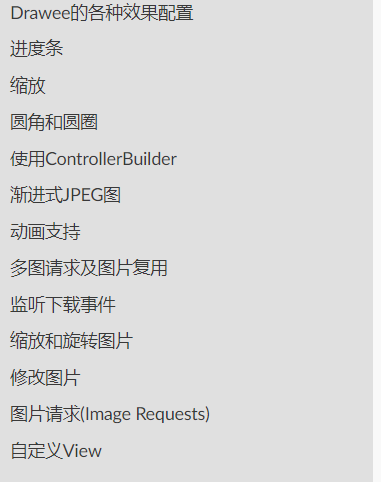

# 前言

图片加载在 Android开发项目中是必不可少的，为了降低开发周期和难度，我们经常会选用一些图片加载的开源库，而Android发展到现在图片加载开源库也越来越多了，下面介绍几种开发中主流的图片加载框架&以及他们之间的对比优缺点。

## Android主流图片加载库

*   [Picasso](https://link.jianshu.com/?t=https://github.com/square/picasso)
*   [Glide](https://link.jianshu.com/?t=https://github.com/bumptech/glide)
*   [Fresco](https://link.jianshu.com/?t=https://github.com/facebook/fresco)

## 介绍& 对比

### 1.Picasso
`Picasso`中文翻译为'毕加索',由Square公司开源的一个适用于Android的强大图像下载和缓存库.

<!--more-->

* 功能介绍

* 图片的异步加载（最基础功能）
* 使用最少的内存完成复杂的图片转换，转换图片以适合所显示的ImageView，来减少内存消耗
* 支持加载过程中和加载错误时显示对应图片
*  在Adapter中的回收不在视野的ImageView和取消已经回收的ImageView下载进程
* 支持加载多种数据源 网络、本地、资源、Assets 等
* 自动添加磁盘和内存二级缓存功能
* 支持优先级处理
* 支持飞行模式、并发线程数根据网络类型而变
> Picasso 没有实现本地缓存功能，交给了 Square 的另外一个网络库 okhttp 去实现，这样的好处是可以通过请求 Response Header 中的 Cache-Control 及 Expired 控制图片的过期时间。

---------------------------
* 与其他开源库对比
> 优点如下:
* 使用简单,代码简洁
* 与Square 公司的其他开源库如 Retrofit 或者 OkHttp搭配使用兼容性会更好些，占用体积也会少些
> 缺点如下:
* 功能较为简单-图片加载；
* 性能（加载速度等等）较（Glide、Fresco）较差
* 自身无实现“本地缓存”

### 2.Glide
`Glide`是由Google开源的一个图片加载库,是一款快速高效的Android开源媒体管理和图像加载框架，它将媒体解码，内存和磁盘缓存以及资源池包装成简单易用的界面.

* 功能介绍
* 图片的异步加载（基础功能）
* 支持设置加载尺寸、设置加载中以及加载失败图片、设置加载动画、设置图文混排
* 多样式的媒体加载(设置缩略图支持：先加载缩略图 然后在加载全图)
* 支持设置磁盘缓存策略、设置跳过内存缓存、清理缓存
* 生命周期集成(然而还是有bug)

* 与其他开源库对比
> 优点如下:
* 支持多样化媒体加载
Glide 不仅是一个图片缓存，它支持 Gif、WebP、缩略图,甚至是 Video
* 生命周期集成
通过设置绑定生命周期，我们可以更加高效的使用Glide提供的方式进行绑定，这样可以更好的让加载图片的请求的生命周期动态管理起来(使用还是有bug)
* 高效的缓存策略
1.支持Memory和Disk图片缓存
2.Picasso 只会缓存原始尺寸的图片，而 Glide 缓存的是多种规格，即 Glide 会根据你 ImageView 的大小来缓存相应大小的图片尺寸
3.内存开销小,Glide 默认的 Bitmap 格式是 RGB_565 格式，而 Picasso 默认的是 ARGB_8888 格式，占用内存要小一半

> 缺点如下:

* 使用方法复杂,实现方法较多
* 使用较Fresco简单，但性能（加载速度 & 缓存）却比不上Fresco

### 3.Fresco
`Fresco`是由Facebook开源的用于管理图像及其使用内存的Android库

* 功能介绍

> 具体功能请前往[官方文档](https://www.fresco-cn.org/support.html)查看

> 优点如下
* 大大减少了OOM的发生,Facebook在底层使用了C++技术解决图片缓存问题
* 使用简单,几乎全部功能都能在XML文件中直接制定

> 缺点如下:

* 用法变得更加复杂了
* 依赖包更加大了(2-3M)
* 底层设计C++等技术,源码阅读更加困难

至此Android 中主流的三大图片加载框架就介绍完毕了,感谢阅读

欢迎关注作者[darryrzhong](http://www.darryrzhong.site),更多干货等你来拿哟.

### 请赏个小红心！因为你的鼓励是我写作的最大动力！
>更多精彩文章请关注
- [个人博客:darryrzhong](http://www.darryrzhong.xyz)
- [掘金](https://juejin.im/user/5a6c3b19f265da3e49804988)
- [简书](https://www.jianshu.com/users/b7fdf53ec0b9/timeline)
- [SegmentFault](https://segmentfault.com/u/darryrzhong_5ac59892a5882/articles)
- [慕课网手记](https://www.imooc.com/u/6733207)

