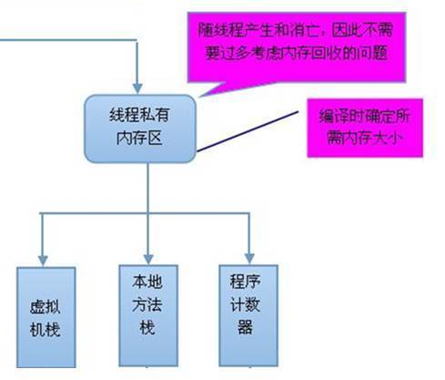
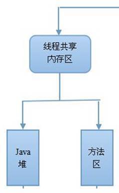

# 为什么要了解虚拟机

JVM不单单只支持Java语言，也支持其他语言（Scala、Kotlin、Groovy等等）

区块链2.0--以太坊(比特币是区块链1.0) 中提供了EVM的虚拟机，它的实现和JVM类似，基于栈、生成脚本编译成字节码来执行。知识通用。（理论大于实际）

# 虚拟机历史

了解即可，无需关注

Hotspot什么意思：热点代码探测技术，及时编译器（发现最有价值的代码，如果代码用得非常多，就会把这些代码编译成本地代码）。

华为有的项目用的J9

谷歌(谷歌主要开发语言也是Java)：Google Android Dalivk VM,后面的课程会有单独的老师具体讲DVM，了解完JVM再去了解DVM就很容易。

# 未来的Java技术

**模块化****:**使用得最多OSGI，应用层面就是微服务，互联网的发展方向

**混合语言**：多个语言都可以运行在JVM中

**多核并行**：CPU从高频次转变为多核心，多核时代。JDK1.7引入了Fork/Join，JDK1.8提出lambda表达式(函数式编程天生适合并行运行)

**丰富语法：**JDK5提出自动装箱、泛型(并发编程讲到)、动态注解等语法。JDK7二进制原生支持。try-catch-finally 至try-with-resource

**64****位：**虽然同样的程序64位内存消耗比32位要多一点，但是支持内存大，所以虚拟机都会完全过渡到64位。

**更强的垃圾回收：**JDK11 –ZGC（TB级别内存回收））：有色指针、加载屏障

# 运行时数据区域

抽象概念，内部实现依赖寄存器、高速缓存、主内存（具体要分析JVM源码 C++语言实现，没必要看）

计算器=指令+数据

虚拟机栈、本地方法栈(native方法)、程序计数器：指令相关

堆、方法：数据相关

<!--more-->

# 程序计数器

较小的内存空间，当前线程执行的字节码的行号指示器；各线程之间独立存储，互不影响（面试可能问到为什么需要）

# 虚拟机栈

**栈：**数据结构的特点和java中方法中调用方法的特性一致。（为什么JVM使用栈 –演示代码StackFilo）

**虚拟机栈：**每个线程私有的，线程在运行时，在执行每个方法的时候都会打包成一个栈帧，存储了局部变量表，操作数栈，动态链接，方法出口等信息，然后放入栈。每个时刻正在执行的当前方法就是虚拟机栈顶的栈桢。方法的执行就对应着栈帧在虚拟机栈中入栈和出栈的过程。

栈的大小缺省为1M，可用参数 –Xss调整大小，例如-Xss256k

 

**局部变量表:**顾名思义就是局部变量的表，用于存放我们的局部变量的。首先它是一个32位的长度，主要存放我们的Java的八大基础数据类型，一般32位就可以存放下，如果是64位的就使用高低位占用两个也可以存放下，如果是局部的一些对象，比如我们的Object对象，我们只需要存放它的一个引用地址即可。

**操作数据栈**：存放我们方法执行的操作数的，它就是一个栈，先进后出的栈结构，操作数栈，就是用来操作的，操作的的元素可以是任意的java数据类型，所以我们知道一个方法刚刚开始的时候，这个方法的操作数栈就是空的，操作数栈运行方法是会一直运行入栈/出栈的操作

**动态连接:**Java语言特性多态（需要类加载、运行时才能确定具体的方法），动态特性（Groovy、JS、动态代理）

**返回地址:**正常返回（调用程序计数器中的地址作为返回）、异常的话（通过异常处理器表<非栈帧中的>来确定）

# 本地方法栈

各虚拟机自由实现，

# 线程共享的区域

## 方法区/永久代

用于存储已经被虚拟机加载的类信息，常量("zdy","123"等)，静态变量(static变量)等数据，可用以下参数调整：

jdk1.7及以前：-XX:PermSize；-XX:MaxPermSize；

jdk1.8以后：-XX:MetaspaceSize； -XX:MaxMetaspaceSize

jdk1.8以后大小就只受本机总内存的限制

如：-XX:MaxMetaspaceSize=3M

 

## 堆

几乎所有对象都分配在这里，也是垃圾回收发生的主要区域，可用以下参数调整：

-Xms：堆的最小值；

-Xmx：堆的最大值；

-Xmn：新生代的大小；

-XX:NewSize；新生代最小值；

-XX:MaxNewSize：新生代最大值；

例如- Xmx256m

# 直接内存

不是虚拟机运行时数据区的一部分，也不是java虚拟机规范中定义的内存区域；如果使用了NIO,这块区域会被频繁使用，在java堆内可以用directByteBuffer对象直接引用并操作；

这块内存不受java堆大小限制，但受本机总内存的限制，可以通过-XX:MaxDirectMemorySize来设置（默认与堆内存最大值一样），所以也会出现OOM异常。

# 站在线程角度来看

# 深入辨析堆和栈

n  **功能** 

Ø 以栈帧的方式存储方法调用的过程，并存储方法调用过程中基本数据类型的变量（int、short、long、byte、float、double、boolean、char等）以及对象的引用变量，其内存分配在栈上，变量出了作用域就会自动释放； 

Ø 而堆内存用来存储Java中的对象。无论是成员变量，局部变量，还是类变量，它们指向的对象都存储在堆内存中； 

n  **线程独享还是共享** 

Ø 栈内存归属于单个线程，每个线程都会有一个栈内存，其存储的变量只能在其所属线程中可见，即栈内存可以理解成线程的私有内存。 

Ø 堆内存中的对象对所有线程可见。堆内存中的对象可以被所有线程访问。 

n  **空间大小** 

栈的内存要远远小于堆内存

## 栈溢出

参数：-Xss256k

java.lang.StackOverflowError  一般的方法调用是很难出现的，如果出现了要考虑是否有无限递归。

虚拟机栈带给我们的启示：方法的执行因为要打包成栈桢，所以天生要比实现同样功能的循环慢，所以树的遍历算法中：递归和非递归(循环来实现)都有存在的意义。递归代码简洁，非递归代码复杂但是速度较快。

 

# 虚拟机中的对象

## 对象的分配

虚拟机遇到一条new指令时：

### 1）检查加载

先执行相应的类加载过程。

### 2）分配内存

#### 指针碰撞

接下来虚拟机将为新生对象分配内存。为对象分配空间的任务等同于把一块确定大小的内存从Java堆中划分出来。

如果Java堆中内存是绝对规整的，所有用过的内存都放在一边，空闲的内存放在另一边，中间放着一个指针作为分界点的指示器，那所分配内存就仅仅是把那个指针向空闲空间那边挪动一段与对象大小相等的距离，这种分配方式称为“**指针碰撞**”。

#### 空闲列表

如果Java堆中的内存并不是规整的，已使用的内存和空闲的内存相互交错，那就没有办法简单地进行指针碰撞了，虚拟机就必须维护一个列表，记录上哪些内存块是可用的，在分配的时候从列表中找到一块足够大的空间划分给对象实例，并更新列表上的记录，这种分配方式称为“**空闲列表**”。

选择哪种分配方式由Java堆是否规整决定，而Java堆是否规整又由所采用的垃圾收集器是否带有压缩整理功能决定。

#### 并发安全

除如何划分可用空间之外，还有另外一个需要考虑的问题是对象创建在虚拟机中是非常频繁的行为，即使是仅仅修改一个指针所指向的位置，在并发情况下也并不是线程安全的，可能出现正在给对象A分配内存，指针还没来得及修改，对象B又同时使用了原来的指针来分配内存的情况。

##### CAS机制

解决这个问题有两种方案，一种是对分配内存空间的动作进行同步处理——实际上虚拟机采用CAS配上失败重试的方式保证更新操作的原子性；

##### 分配缓冲

另一种是把内存分配的动作按照线程划分在不同的空间之中进行，即每个线程在Java堆中预先分配一小块私有内存，也就是本地线程分配缓冲（Thread Local Allocation Buffer,TLAB），如果设置了虚拟机参数 -XX:UseTLAB，在线程初始化时，同时也会申请一块指定大小的内存，只给当前线程使用，这样每个线程都单独拥有一个Buffer，如果需要分配内存，就在自己的Buffer上分配，这样就不存在竞争的情况，可以大大提升分配效率，当Buffer容量不够的时候，再重新从Eden区域申请一块继续使用。

TLAB的目的是在为新对象分配内存空间时，让每个Java应用线程能在使用自己专属的分配指针来分配空间，减少同步开销。

TLAB只是让每个线程有私有的分配指针，但底下存对象的内存空间还是给所有线程访问的，只是其它线程无法在这个区域分配而已。当一个TLAB用满（分配指针top撞上分配极限end了），就新申请一个TLAB。

### 3）内存空间初始化

（注意不是构造方法）内存分配完成后，虚拟机需要将分配到的内存空间都初始化为零值(如int值为0，boolean值为false等等)。这一步操作保证了对象的实例字段在Java代码中可以不赋初始值就直接使用，程序能访问到这些字段的数据类型所对应的零值。

### 4）设置

接下来，虚拟机要对对象进行必要的设置，例如这个对象是哪个类的实例、如何才能找到类的元数据信息、对象的哈希码、对象的GC分代年龄等信息。这些信息存放在对象的对象头之中。

### 5）对象初始化

在上面工作都完成之后，从虚拟机的视角来看，一个新的对象已经产生了，但从Java程序的视角来看，对象创建才刚刚开始，所有的字段都还为零值。所以，一般来说，执行new指令之后会接着把对象按照程序员的意愿进行初始化，这样一个真正可用的对象才算完全产生出来。

# 对象的内存布局

在HotSpot虚拟机中，对象在内存中存储的布局可以分为3块区域：对象头（Header）、实例数据（Instance Data）和对齐填充（Padding）。

对象头包括两部分信息，第一部分用于存储对象自身的运行时数据，如哈希码（HashCode）、GC分代年龄、锁状态标志、线程持有的锁、偏向线程ID、偏向时间戳等。 

对象头的另外一部分是类型指针，即对象指向它的类元数据的指针，虚拟机通过这个指针来确定这个对象是哪个类的实例。

第三部分对齐填充并不是必然存在的，也没有特别的含义，它仅仅起着占位符的作用。由于HotSpot VM的自动内存管理系统要求对对象的大小必须是8字节的整数倍。当对象其他数据部分没有对齐时，就需要通过对齐填充来补全。

# 对象的访问定位

建立对象是为了使用对象，我们的Java程序需要通过栈上的reference数据来操作堆上的具体对象。目前主流的访问方式有使用句柄和直接指针两种。

## 句柄

如果使用句柄访问的话，那么Java堆中将会划分出一块内存来作为句柄池，reference中存储的就是对象的句柄地址，而句柄中包含了对象实例数据与类型数据各自的具体地址信息。

## 直接指针

如果使用直接指针访问， reference中存储的直接就是对象地址。

这两种对象访问方式各有优势，使用句柄来访问的最大好处就是reference中存储的是稳定的句柄地址，在对象被移动（垃圾收集时移动对象是非常普遍的行为）时只会改变句柄中的实例数据指针，而reference本身不需要修改。

使用直接指针访问方式的最大好处就是速度更快，它节省了一次指针定位的时间开销，由于对象的访问在Java中非常频繁，因此这类开销积少成多后也是一项非常可观的执行成本。

对Sun HotSpot而言，它是使用直接指针访问方式进行对象访问的。

# 逃逸分析

## 栈上分配

虚拟机提供的一种优化技术，基本思想是，对于线程私有的对象，将它打散分配在栈上，而不分配在堆上。好处是对象跟着方法调用自行销毁，不需要进行垃圾回收，可以提高性能。

栈上分配需要的技术基础，逃逸分析。逃逸分析的目的是判断对象的作用域是否会逃逸出方法体。注意，任何可以在多个线程之间共享的对象，一定都属于逃逸对象。

public void test(int x,inty ){

String x = “”;

User u = ….

….. 

}

User类型的对象u就**没有**逃逸出方法test。

public  User test(int x,inty ){

String x = “”;

User u = ….

….. 

return u;

}

User类型的对象u就逃逸出方法test。

### 如何启用栈上分配

-server JVM运行的模式之一, server模式才能进行逃逸分析， JVM运行的模式还有mix/client

-Xmx10m和-Xms10m：堆的大小

-XX:+DoEscapeAnalysis：启用逃逸分析(默认打开)

-XX:+PrintGC：打印GC日志

-XX:+EliminateAllocations：标量替换(默认打开)

-XX:-UseTLAB 关闭本地线程分配缓冲

TLAB： ThreadLocalAllocBuffer，具体解释参见下文《虚拟机中的对象---对象的分配----2）》

对栈上分配发生影响的参数就是三个，-server、-XX:+DoEscapeAnalysis和-XX:+EliminateAllocations，任何一个发生变化都不会发生栈上分配，因为启用逃逸分析和标量替换默认是打开的，所以，在我们的例子中，JVM的参数只用-server一样可以有栈上替换的效果(以King老师机器上JDK1.8为例，其他版本JDK请自行尝试)。

### 栈上分配的效果

同样的User的对象实例，分配100000000次，启用栈上分配，只需6ms，不启用，需要900多ms。

 