`本文原创首发于慕课网,欢迎转载,注明出处即可.`
>本篇博文将继续带大家优化博客站点,打造上线站点,设置个性域名等

阅读本文前建议先行阅读本人另外三篇遍基础博文
1.[关于Hexo6.0搭建个人博客(基础篇)](https://www.jianshu.com/p/d574962baa16)
2.[关于Hexo6.0搭建个人博客(主题优化-进阶篇)](https://www.jianshu.com/p/043a4ae7684d)
3.[关于Hexo6.0搭建个人博客(主题优化-高级篇)](https://www.jianshu.com/p/52753aafd478)

>本篇博文将手把手教大家打造线上个人站点,设置个性域名,以及托管项目到[github](https://github.com/)及[coding](https://coding.net/)上,同时让[Google](https://www.google.com/search?rlz=1C1CHWL_zh-CNSG777SG777&ei=P1MGW9DZGJL4zgLr25SoDQ&q=darryrzhong&oq=darryrzhong&gs_l=psy-ab.3...33.33.0.256.1.1.0.0.0.0.0.0..0.0....0...1c.1.64.psy-ab..1.0.0....0.MrNV629Y62k)和[百度](https://www.baidu.com/s?tn=99006304_1_oem_dg&isource=infinity&wd=darryrzhong)两大搜索引擎收录你的站点,提升站点的自然流量.

# 1. 购买个性域名

估计大家折腾了这么久也就是为 了拥有一个自己的个性站点,所以强烈建议大家为自己的博客站点配置一个独一无二的个性域名.我这里选择阿里旗下的[万网](https://wanwang.aliyun.com/?spm=5176.8142029.735711.62.f0586d3eFXYcmo);
域名种类如下:
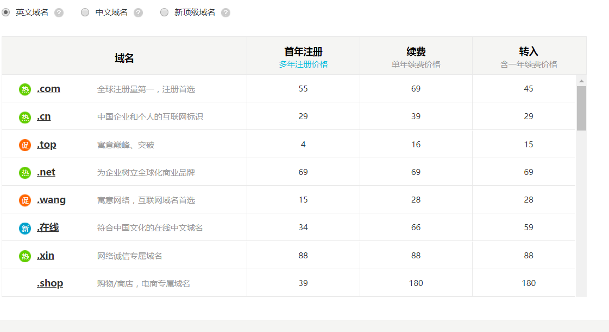

>有大家常见的.com、.cn、net等等,不过这些都比较贵,当然你不缺钱的话.com这些常见的自然是最好的选择了.像我们这种穷苦人家就只能用用便宜的啦( ๑ŏ ﹏ ŏ๑ )伤心.

好了,接下来教大家购买注册域名,我这里选用.site后缀,这是代表站点/网站类的域名最好的选择了,关键是便宜啦.

<!--more-->


##### 1.去万网注册账号
##### 2.购买你想要的域名
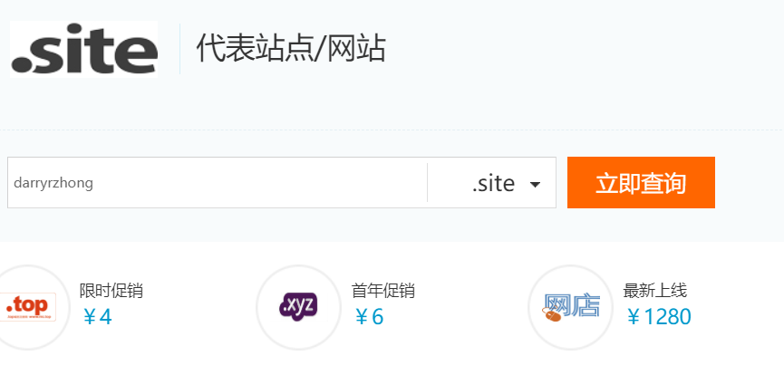
输入你想要的个性域名,如果没有被注册的话,就可以直接购买了.
好了,这样我们就有自己的个性域名了,下面教大家怎么配置.

# 2.将项目托管到coding并被百度收录
首先教大家布局好百度收录及coding托管,毕竟国内用百度搜索的人数还是占大多数,而且百度爬不了github,这是最衰的一件事了.

##### 1.注册coding账户
##### 2.创建新项目
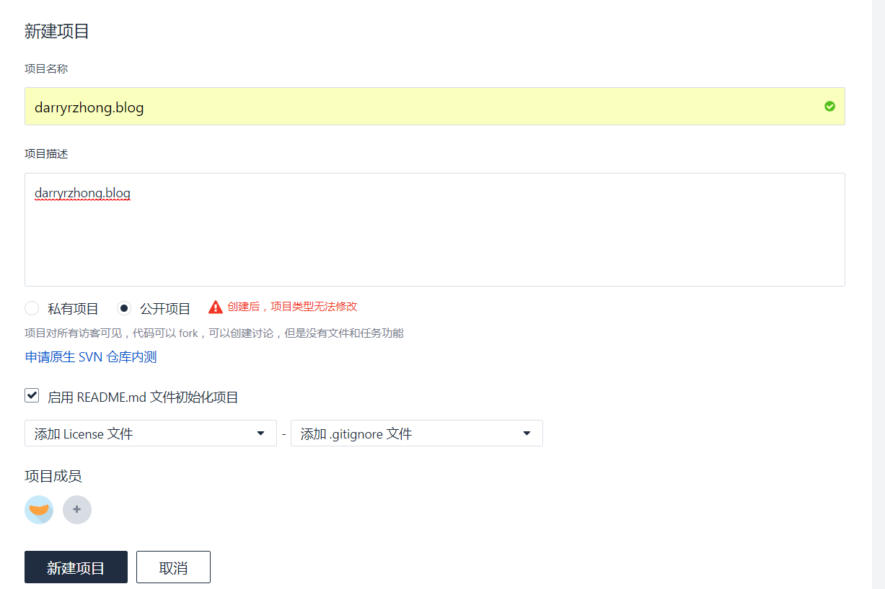
这里创建项目的时候,网上很多教程说是要项目名称和账户名称相同,这个只是方便使用ccoding提供的地址访问,我们这里既然要配置自己的域名,就不用一样了,而且一样看起来很别扭,可以和我一样后缀加上个.blog.

##### 3.添加SSH公钥

>生成ssh:

Linux 与 Mac 都是默认安装了 SSH ，而 Windows 系统安装了 Git Bash 应该也是带了 SSH的。大家可以在终端（win下在 Git Bash 里）输入 ssh 如果出现以下提示证明你本机已经安
装 SSH， 否则请搜索自行安装下
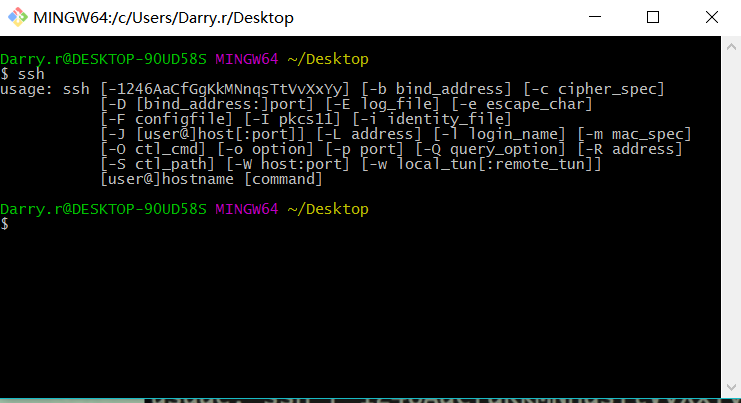

>添加ssh:

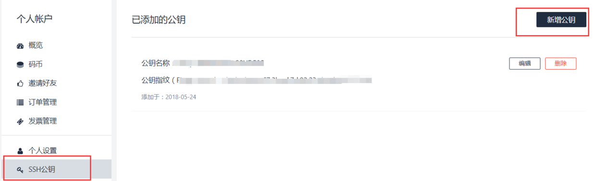

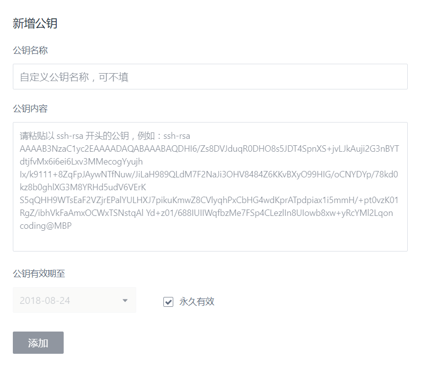
这个.ssh文件一般是在系统C盘下的用户下,里面的文件全部是隐藏文件设置显示就可以看到了.
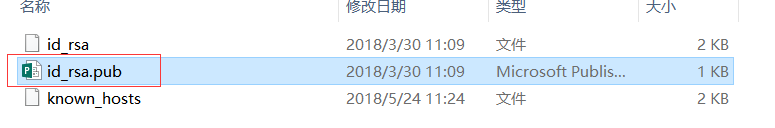
将文件里面的公钥复制到上面,添加就可以了.


##### 4.开启pages服务

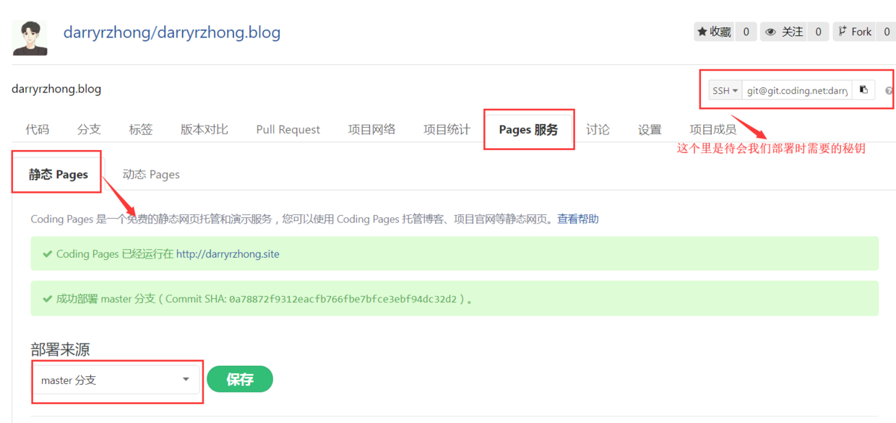

选择master分支,保存
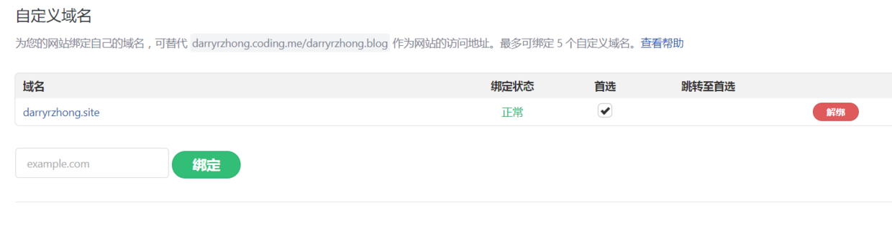
这里添加你刚才购买好的域名,绑定即可.

>配置域名

进入万网控制台的云解析DNS设置中,配置域名解析.
先介绍两个记录类型:
1.  A- 将域名指向一个IPV4地址
2. CNAME-将域名指向另外一个域名

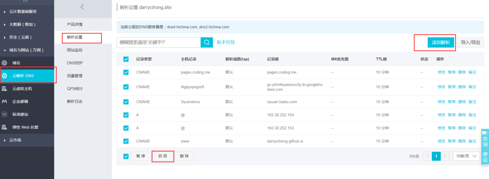
以上是我配置的所有绑定域名
添加解析:
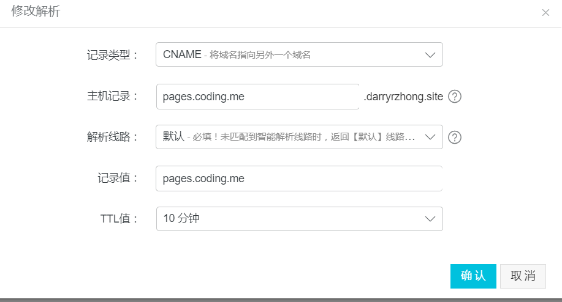

确认启用即可,到这里我们就已经为coding上的项目配置好了个性域名了

##### 5. 将项目托管到coding上
首先打开博客根目录配置文件`_config.yml`,添加以下内容:

```
deploy:
  type: git
  repository:
    github: git@github.com:darryrzhong/darryrzhong.github.io.git
    coding: git@git.coding.net:darryrzhong/darryrzhong.blog.git
  branch: master
```
这里我同时将项目托管到了`github`和`coding`上,所以我们暂时只需添加coding即可,不然待会会报错,后面会教大家托管`github`;

最后一步:将项目push到coding上.
在Git Bash下输入命令:
```
hexo g
hexo d
```
基本到这里我们的项目就成功托管到coding上了.
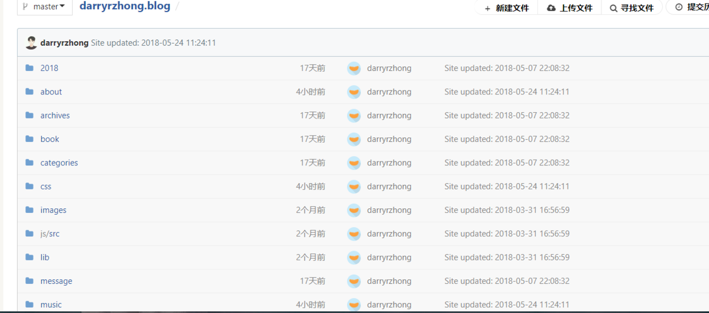

然后输入你域名或者coding默认提供的地址,就可以访问我们的站点了.

##### 6.SEO优化之百度收录

> 推广其实是一个挺烦的事,作为个人站点想要让更多的人知道的话,我们就得让别人能够通过搜索引擎搜索到我们博客内容,给我们带来自然流量,所以我们必须要实现SEO优化,让我们站点真正成为线上个人站点.

###### 1.让百度收录你的站点
首先直接百度搜索你的域名,比如我随意搜一个:
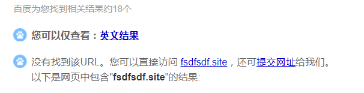
这就说明这个站点没有被百度收录,之后我们选择`提交网址`;
进入百度站长平台登录成功后选择`用户中心-站点管理-添加网站`;
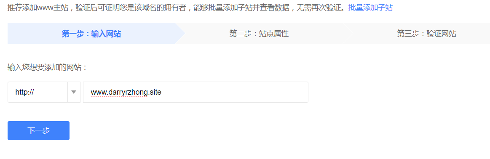
按照步骤要求进行即可,最后一步验证网址所有权:
这里有三种验证方式,我们挑最简单的CNAME来就行了.
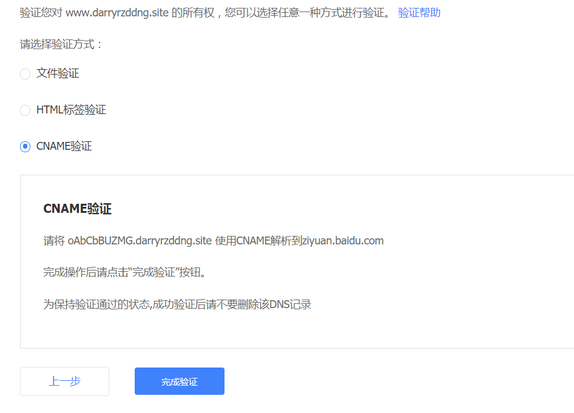

添加一条解析即可,如下:
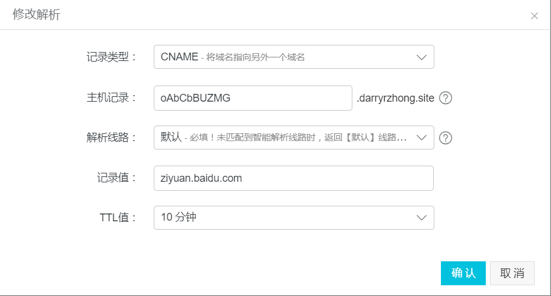

就这么简单,验证就完成了.
接下来我们需要生成网站地图`sitemap`,使用sitemap方式向百度提交我们的网址.

> Git Bash下安装sitemap插件

```
npm install hexo-generator-sitemap --save     
npm install hexo-generator-baidu-sitemap --save
```
修改站点配置文件`_config.yml`中url内容如下:
```
 URL
## If your site is put in a subdirectory, set url as 'http://yoursite.com/child' and root as '/child/'
url: http://darryrzhong.site
root: /
permalink: :year/:month/:day/:title/
permalink_defaults:
```
可以看到站点根目录下`public`文件下
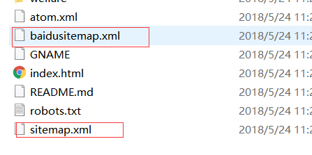

会生成两个文件,
带有baidu的是百度专用的,另外一个是通用的.
接下来我们将生成的sitemap文件提交给百度,
`站点管理-站点属性- 链接提交-自动提交-sitemap`
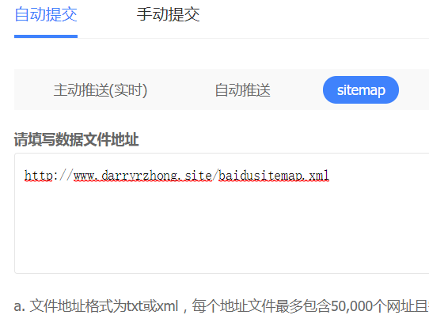
将域名换成你自己的就行了.

> 到这里我们的站点就算是提交给了百度了,不过百度实在是不可恭维,速度太慢了,一般可能要一个星期左右才能被收录到,所以刚提交完搜不到很正常,过几天在试试应该就能搜索到了.

如果被正常收录了,效果如下:

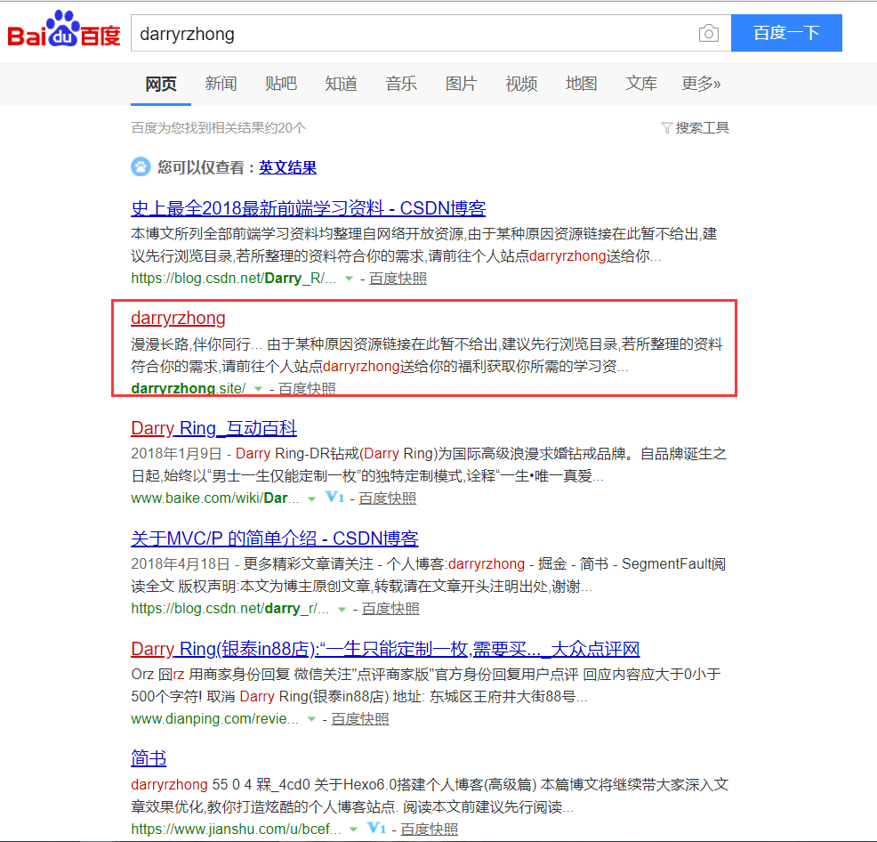

> 由于篇幅问题,Google收录就放在下篇给大家讲解了

欢迎关注作者[darryrzhong](http://www.darryrzhong.site),更多干货等你来拿哟.

### 请赏个小红心！因为你的鼓励是我写作的最大动力！
>更多精彩文章请关注
- [个人博客:darryrzhong](http://www.darryrzhong.xyz)
- [掘金](https://juejin.im/user/5a6c3b19f265da3e49804988)
- [简书](https://www.jianshu.com/users/b7fdf53ec0b9/timeline)
- [SegmentFault](https://segmentfault.com/u/darryrzhong_5ac59892a5882/articles)
- [慕课网手记](https://www.imooc.com/u/6733207)


