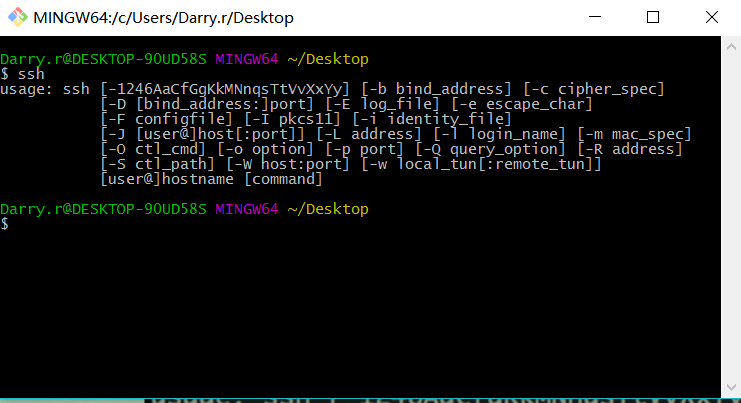
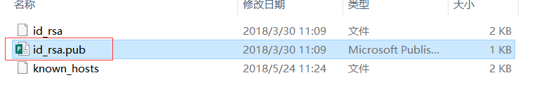

`本文原创首发于慕课网,欢迎转载,注明出处即可.`
>本篇博文将继续带大家优化博客站点,打造上线站点,设置个性域名等

阅读本文前建议先行阅读本人另外三篇遍基础博文
1.[关于Hexo6.0搭建个人博客(基础篇)](https://www.jianshu.com/p/d574962baa16)
2.[关于Hexo6.0搭建个人博客(进阶篇)](https://www.jianshu.com/p/043a4ae7684d)
3.[关于Hexo6.0搭建个人博客(高级篇)](https://www.jianshu.com/p/52753aafd478)
4.[关于Hexo6.0搭建个人博客(coding+百度-收录篇)](https://www.jianshu.com/p/ba81d31b56c9)


>本篇博文将手把手教大家打造线上个人站点,设置个性域名,以及托管项目到[github](https://github.com/)及[coding](https://coding.net/)上,同时让[Google](https://www.google.com/search?rlz=1C1CHWL_zh-CNSG777SG777&ei=P1MGW9DZGJL4zgLr25SoDQ&q=darryrzhong&oq=darryrzhong&gs_l=psy-ab.3...33.33.0.256.1.1.0.0.0.0.0.0..0.0....0...1c.1.64.psy-ab..1.0.0....0.MrNV629Y62k)和[百度](https://www.baidu.com/s?tn=99006304_1_oem_dg&isource=infinity&wd=darryrzhong)两大搜索引擎收录你的站点,提升站点的自然流量.

# 1. 购买个性域名
请看[关于Hexo6.0搭建个人博客(coding+百度-收录篇)](https://www.jianshu.com/p/ba81d31b56c9)


# 2.将站点托管到github上

####1.注册giithub账号
####2.新建仓库


#### 3.配置SSH

<!--more-->

 

>生成ssh:

Linux 与 Mac 都是默认安装了 SSH ，而 Windows 系统安装了 Git Bash 应该也是带了 SSH的。大家可以在终端（win下在 Git Bash 里）输入 ssh 如果出现以下提示证明你本机已经安
装 SSH， 否则请搜索自行安装下


>添加ssh:


这个.ssh文件一般是在系统C盘下的用户下,里面的文件全部是隐藏文件设置显示就可以看到了.

将文件里面的公钥复制到上面,添加就可以了.

#### 4.提交项目到github上

打开博客站点配置文件`_config.yml`,添加以下内容:
```
# Deployment
## Docs: https://hexo.io/docs/deployment.html
deploy:
  type: git
  repository:
    github: git@github.com:darryrzhong/darryrzhong.github.io.git
    coding: git@git.coding.net:darryrzhong/darryrzhong.blog.git
  branch: master
```
这里同时托管到了`github`和`coding`上,如果没有配置coding的话,建议先看上篇[百度+coding](),这里只托管到`github`上,所以把`coding`配置删除,否则`push`会报错.

其中地址在这里:


在Git Bash 下执行命令:
```
hexo g 
hexo d
```
如下则表示站点托管成功.


在进入我们的github中看看,就不再是空空如也了


打开浏览器输入xxxxx.github.io就可以成功访问到我们的站点了.

# 3. 为站点设置个性域名.
先介绍两个记录类型:
1.  A- 将域名指向一个IPV4地址
2. CNAME-将域名指向另外一个域名

>github实际上就是一个在线服务器,他提供了两个ip地址:
分别是`192.30.252.154`和`192.30.252.153`;还分配了一个单独域名给每个站点博客,就是之前的`xxxxx.github.io`,所以每一个github账户只能创建一个这样的仓库,分配一个这样的地址.

接下来,登录万网设置DNS云服务器解析:


添加完解析之后,设置github域名绑定就完功了.


> 到这里我们就成功将站点项目托管到github上了,并且成功设置了我们自己的个性域名了.

# 4.将个人站点收录于Google
> 关于Google的话,国内是禁止访问的,所以大多数人还是用百度搜索的,但是百度的确是不敢恭维,所以还是免不了要用Google的,至于怎么用Google就不在本文的范畴了,当然也可以后台留言哦,我们可以私下讨论讨论,后台有一份免费的vpn大礼包哟!.

Google收录和百度的做法是一样的,异曲同工:
#### 1.首先进入[google站点平台](https://www.google.com/webmasters/#?modal_active=none)


#### 2.没有google账号的话,需要注册一个,有的话就直接登录


#### 3.提交博客站点(个性域名),验证所有权.


这里我们选择最简单的域名解析方法,按照步骤一步一步来就行了.


#### 4.提交站点地图


验证完所有权后,就可以提交我们的站点地图sitemap了.

添加/测试站点地图

提交成功后,我们的站点就已经被Google收录了.

折腾了这么久,一起来看看成果吧


> 到这里我们就成功将站点项目托管到github上,并且配置上了我们的个性域名,还被Google收录了,是不是有点小激动,成就感爆棚,哈哈.

>写到这里,[关于Hexo6.0搭建个人博客系列](https://www.jianshu.com/nb/24733773)就全部结束了,比较有追求的童鞋也可以自己写js打造真正独一无二的个人站点.后续还会写一篇关于利用`markdown`写文章的小技巧,毕竟博客是用来写作的嘛!


欢迎关注作者[darryrzhong](http://www.darryrzhong.site),更多干货等你来拿哟.

### 请赏个小红心！因为你的鼓励是我写作的最大动力！
>更多精彩文章请关注
- [个人博客:darryrzhong](http://www.darryrzhong.xyz)
- [掘金](https://juejin.im/user/5a6c3b19f265da3e49804988)
- [简书](https://www.jianshu.com/users/b7fdf53ec0b9/timeline)
- [SegmentFault](https://segmentfault.com/u/darryrzhong_5ac59892a5882/articles)
- [慕课网手记](https://www.imooc.com/u/6733207)


