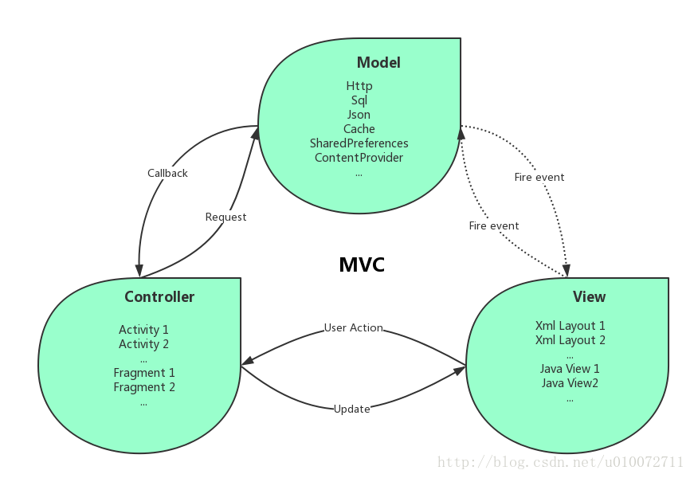
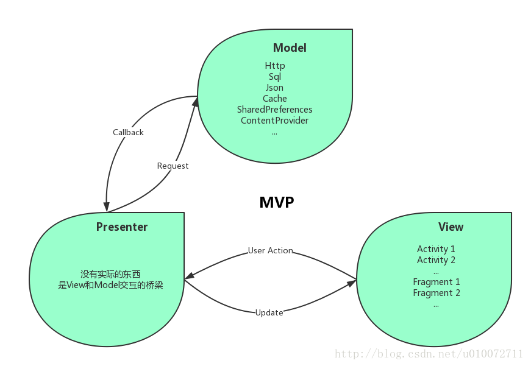

#### 写在最前面的那些话
相信对于大多数小白来说,关于`MVP`、`MVC`设计模式肯定是听过也看到过很多次了,也许也有过一些简单了解,但关于TA的具体概念,如何使用以及具体应用等都毫无所知,所以本着许多小伙伴一看到`mvp`、`mvc`就一脸懵逼的表情(当然也包括本人了⊙▽⊙)#),最近上手一个基于`mvp`框架的`mosby`框架的练手项目,所以决定
去好好研究一番`mvp`设计模式以及`mosby`的原理以及使用,所以在此写下这篇博文,希望能够帮助到正在学习或者准备学习`mvp`设计模式的那些小伙伴了.
相信很多小伙伴应该都有这样一个共同的认知,关于技术,网上一搜一大堆,但是质量自然是参差不齐,身处互联网时代最好的一点就是资源共享,本着为更多的小伙伴节省搜寻资源的时间以及筛选优质资源的时间成本,决定以小白的身份来写写`mvp`那些事,旨在共享资源,共同进步,不喜勿喷!

>快加入学习的队伍来吧,欢迎各路大神留下宝贵意见.

`什么是MVC(Model View Controller)模式?`

`MVC`全名是`Model View Controller`，是模型(`model`)－视图(`view`)－控制器(`controller`)的缩写，一种软件设计典范，用一种业务逻辑、数据、界面显示分离的方法组织代码，将业务逻辑聚集到一个部件里面，在改进和个性化定制界面及用户交互的同时，不需要重新编写业务逻辑。其中M层处理数据，业务逻辑等(适合做一些业务逻辑处理，比如数据库存取操作，网络操作，复杂的算法，耗时的任务等都在model层处理)；V层处理界面的显示结果(XML布局可以视为V层，显示Model层的数据结果)；C层起到桥梁的作用，来控制V层和M层通信以此来达到分离视图显示和业务逻辑层(在Android中，Activity处理用户交互问题，因此可以认为Activity是控制器，Activity读取V视图层的数据，控制用户输入，并向Model发送数据请求)。

`Model`: 数据层. 负责与网络层和数据库层的逻辑交互.
`View`: UI层. 显示数据, 并向Controller报告用户行为.
`Controller`:负责从视图中取得数据然后发送给模型,根据用户在视图中的行为去更新模型的逻辑.

一般业务逻辑如下:

<!--more-->

1、为了使得视图接口可以与模型和控制器进行交互，控制器执行一些初始化事件
2、用户通过视图（用户接口）执行一些操作
3、控制器处理用户行为(可以用观察着模式实现)并通知模型进行更新
4、模型引发一些事件，以便将改变发告知视图
5、视图处理模型变更的事件，然后显示新的模型数据
6、用户接口等待用户的进一步操作

`什么是MVP(Model-View-Presenter)模式?
`

`MVP `是从经典的模式`MVC`演变而来，它们的基本思想有相通的地方：`Controller`/`Presenter`负责逻辑的处理，`Model`提供数据，`View`负责显示。作为一种新的模式，`MVP`与`MVC`有着一个重大的区别：在`MVP`中`View`并不直接使用`Model`，它们之间的通信是通过`Presenter` (`MVC`中的`Controller`)来进行的，所有的交互都发生在`Presenter`内部，而在`MVC`中`View`会从直接`Model`中读取数据而不是通过 `Controller`。

`Model`: 数据层. 负责与网络层和数据库层的逻辑交互.
`View`: UI层. 显示数据, 并向Presenter报告用户行为.
`Presenter`: 从Model拿数据, 应用到UI层, 管理UI的状态, 决定要显示什么, 响应用户的行为.

`MVP`模式的最主要优势就是耦合降低, `Presenter`变为纯Java的代码逻辑, 不再与Android Framework中的类如Activity, Fragment等关联, 便于写单元测试.

>因为在mvc模式中view层与Controller层并没有完全分离开,所以当模块功能越来越大,扩展越来越多时,代码依然会显得臃肿,所以在Android开发中mvc几乎被mvp所取代了,所以开发中首选自然是mvp设计模式了.

MVP与MVC有着一个重大的区别：在MVP中View并不直接使用Model，它们之间的通信是通过Presenter (MVC中的Controller)来进行的，所有的交互都发生在Presenter内部，而在MVC中View会从直接Model中读取数据而不是通过 Controller。
MVC/P模式的核心是为了将模型从视图/控制器中分离出来，从而使得模型独立于它们，因此模型不包含对视图和控制的引用。

>好了,关于mvc/mvp设计模式最简单概念部分已经介绍完了,相信大家对TA不在是一脸懵逼了吧,当然这里值得一提的是,这两种设计模式一般是不用在小项目中的,那样反而会显得代码过度臃肿,一般在大型项目中,且业务逻辑相对复杂,页面切换显示比较多需要进行模块化设计时就需要使用MVP设计模式了,这时你就能体会到TA的优势了.
----

# 后记总结:
相信看完上面的简单介绍(是不是想说一句,尼玛怎么这么少还没看过瘾呢、哈哈),你应该对mvp、mvc设计模式有了一些基本的了解,但肯定对TA还是有很多不清楚,不明白的地方,所以这里才是真正分享资源的开始,也是你开始学习mvp设计模式的开始之地.
>本着不重复造轮子和胡乱复制、粘贴忽悠人的原则,就直接拿过来分享给你们了:

- [MVC和MVP的详细比较以及简单代码展示](https://blog.csdn.net/wu371894545/article/details/55258668)
---
### 请赏个小红心！因为你的鼓励是我写作的最大动力！
>更多精彩文章请关注
- [个人博客:darryrzhong](http://www.darryrzhong.xyz)
- [掘金](https://juejin.im/user/5a6c3b19f265da3e49804988)
- [简书](https://www.jianshu.com/users/b7fdf53ec0b9/timeline)
- [SegmentFault](https://segmentfault.com/u/darryrzhong_5ac59892a5882)
- [慕课网手记](https://www.imooc.com/u/6733207)

